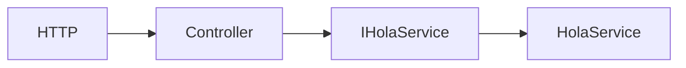

# Lab02 — Dependency Injection

## Objetivo

Mantener `GET /api/hola` de Lab01 y separar la generación del saludo usando DI incorporada en ASP.NET Core sobre .NET 10.

## Conceptos nuevos

- `builder.Services` es una `IServiceCollection`: una colección de descriptores de servicios, con tipo solicitado, implementación y lifetime. Es el lugar donde registrar dependencias antes de `Build()`.
- `builder.Services.AddScoped<IHolaService, HolaService>()` registra qué implementación usar al solicitar `IHolaService`, con lifetime scoped. Registrar describe cómo obtener el servicio; no lo instancia en esa línea.
- `Build()` construye el proveedor de servicios (`IServiceProvider`), que resuelve las dependencias registradas.
- `IHolaService` define el contrato; `HolaService` implementa la generación del saludo. `HolaController` recibe la interfaz mediante constructor injection y la guarda en un campo `readonly`.

## Flujo de ejecución



ASP.NET Core encuentra la acción y activa el controller. Resuelve su parámetro `IHolaService` desde el scope de la petición: crea `HolaService` en su primera resolución y lo entrega al constructor. La acción llama a `ObtenerSaludo()` y devuelve `Ok(...)` con el mismo JSON de Lab01. El diagrama muestra la dependencia sobre la interfaz y su implementación registrada.

## Comparación con Spring Boot

`HolaService` cumple el papel conceptual de un bean `@Service`, pero aquí lo registramos explícitamente en `Program.cs`. La inyección por constructor expresa la misma dependencia sobre un contrato. `ApplicationContext` sirve como referencia conceptual para resolución y gestión de beans; en .NET distinguimos la colección de registros y el proveedor que los resuelve. No son equivalencias internas 1:1.

## Lifetimes

| Registro | Duración de la instancia |
| --- | --- |
| `AddTransient` | Nueva instancia cada vez que el contenedor resuelve el servicio. |
| `AddScoped` | Una instancia por scope; en esta API, por petición HTTP. Resoluciones dentro de la misma petición comparten instancia. |
| `AddSingleton` | Una instancia por proveedor de servicios, compartida durante la vida de la aplicación; debe soportar uso concurrente. |

El laboratorio usa **Scoped**. En Spring, los beans `@Service` son singleton por defecto; el scope request es una referencia conceptual para este uso de scoped. Transient recuerda al scope prototype por crear nuevas instancias al resolver, con diferencias en la gestión de su ciclo de vida.

## Cómo ejecutar

Desde la raíz, con el SDK .NET 10:

```powershell
cd Lab02-DependencyInjection
dotnet run
```

Escucha en `http://localhost:5082`. Detener con `Ctrl+C`.

## Cómo probar

En otra terminal:

```powershell
curl.exe -i http://localhost:5082/api/hola
curl.exe http://localhost:5082/openapi/v1.json
```

El saludo devuelve HTTP 200, `application/json` y:

```json
{"mensaje":"Hola desde ASP.NET Core"}
```

OpenAPI sigue disponible en `Development`, como en Lab01.

## Archivos importantes

- `Program.cs`: registro explícito de interfaz, implementación y lifetime.
- `Services/IHolaService.cs`: contrato `ObtenerSaludo()`.
- `Services/HolaService.cs`: generación del texto.
- `Controllers/HolaController.cs`: constructor injection y respuesta HTTP.
- `Properties/launchSettings.json`: puerto 5082 y entorno local.
- `Lab02-DependencyInjection.csproj`: misma base que Lab01.
- `docs/flujo.mmd`: copia del diagrama para abrir en el preview Mermaid del IDE.

## Documentación oficial de Microsoft

- [DI en ASP.NET Core](https://learn.microsoft.com/en-us/aspnet/core/fundamentals/dependency-injection?view=aspnetcore-10.0)
- [IServiceCollection](https://learn.microsoft.com/en-us/dotnet/api/microsoft.extensions.dependencyinjection.iservicecollection?view=net-10.0)
- [Inyección en controllers](https://learn.microsoft.com/en-us/aspnet/core/mvc/controllers/dependency-injection?view=aspnetcore-10.0)
- [Lifetimes](https://learn.microsoft.com/en-us/dotnet/core/extensions/dependency-injection/service-lifetimes)
