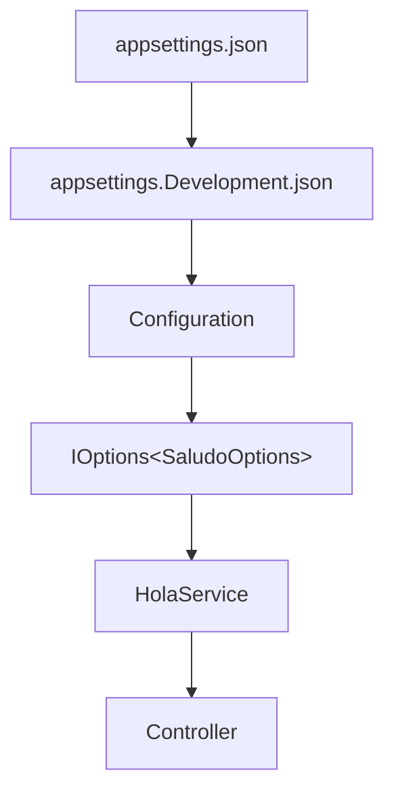

# Lab03 — Configuration

## Objetivo

Mantener `Controller → IHolaService → HolaService` y `GET /api/hola`, obteniendo el saludo de configuración tipada con Options Pattern sobre .NET 10.

## Conceptos nuevos

- `IConfiguration` permite leer claves y secciones de los providers combinados. `builder.Configuration` implementa esa interfaz; `Saludo:Mensaje` identifica una clave anidada.
- `WebApplication.CreateBuilder(args)` carga automáticamente `appsettings.json` y `appsettings.{Environment}.json`.
- `Configure<SaludoOptions>(builder.Configuration.GetSection("Saludo"))` registra en DI el binding de esa sección a las propiedades públicas de `SaludoOptions`.
- `HolaService` recibe `IOptions<SaludoOptions>` por constructor; `.Value` entrega la instancia configurada. `IOptions<T>` conserva ese valor: reiniciar para observar cambios en los archivos.

## Flujo de configuración



El diagrama muestra las fuentes JSON en Development y cómo llegan al servicio mediante DI. La precedencia se aplica **por clave**: Development cambia `Mensaje`, pero conserva `Aplicacion` del archivo base. El controller sigue dependiendo de `IHolaService`.

Prioridad habitual de menor a mayor: JSON base → JSON del entorno → user secrets (si configurados, en Development) → variables de entorno → argumentos de CLI. Por ejemplo, `Saludo__Mensaje` sobrescribe la clave `Saludo:Mensaje` desde una variable de entorno.

## Comparación con Spring Boot

Los archivos JSON cumplen el papel de `application.properties`/`application.yml`. El environment recuerda a un profile, aunque aquí se selecciona un único nombre de entorno. Leer una clave de `IConfiguration` es una referencia conceptual para `@Value`; agrupar y bindear `SaludoOptions` recuerda a `@ConfigurationProperties`. Son comparaciones de uso, sin equivalencias internas 1:1.

## Cómo ejecutar

Desde la raíz, con el SDK .NET 10:

```powershell
cd Lab03-Configuration
dotnet run
```

El perfil local fija Development y `http://localhost:5083`. Detener con `Ctrl+C`.

## Cómo cambiar de environment

Después de detener la aplicación, desde la carpeta del laboratorio en PowerShell:

```powershell
$env:ASPNETCORE_ENVIRONMENT = "Production"
dotnet run --no-launch-profile -- --urls http://localhost:5083
```

`--no-launch-profile` evita que `launchSettings.json` sobrescriba la variable; `--urls` conserva el puerto. Con `WebApplication`, `DOTNET_ENVIRONMENT` tiene prioridad sobre `ASPNETCORE_ENVIRONMENT` si ambas están definidas: ajustala también si corresponde. Sin ninguna de ellas, el entorno por defecto es Production.

Aquí no hay `appsettings.Production.json`: se usan los valores base. Después de detener con `Ctrl+C`, quitar la variable de esta terminal y volver al perfil local:

```powershell
Remove-Item Env:ASPNETCORE_ENVIRONMENT
dotnet run
```

Si ajustaste `DOTNET_ENVIRONMENT`, restaurá también su valor anterior.

## Cómo probar

En otra terminal:

```powershell
curl.exe -i http://localhost:5083/api/hola
```

HTTP 200 y `application/json`. En Development:

```json
{"mensaje":"Hola desde Development (dotnet-modern-refresh)"}
```

En Production:

```json
{"mensaje":"Hola desde ASP.NET Core (dotnet-modern-refresh)"}
```

`/openapi/v1.json` sigue disponible solamente en Development.

## Archivos importantes

- `appsettings.json` y `appsettings.Development.json`: valores base y sobrescritura parcial.
- `Configuration/SaludoOptions.cs`: propiedades tipadas para el binding.
- `Program.cs`: sección de configuración, binding y registro scoped.
- `Services/HolaService.cs`: constructor con `IOptions<SaludoOptions>` y composición del saludo.
- `Services/IHolaService.cs` y `Controllers/HolaController.cs`: mismo contrato y flujo HTTP de Lab02.
- `Properties/launchSettings.json`: environment y puerto locales.
- `docs/configuracion.mmd`: copia del diagrama para el preview del IDE.

## Documentación oficial de Microsoft

- [Configuración y precedencia](https://learn.microsoft.com/en-us/aspnet/core/fundamentals/configuration/?view=aspnetcore-10.0)
- [Options Pattern y binding](https://learn.microsoft.com/en-us/aspnet/core/fundamentals/configuration/options?view=aspnetcore-10.0)
- [Environments y perfiles de ejecución](https://learn.microsoft.com/en-us/aspnet/core/fundamentals/environments?view=aspnetcore-10.0)
