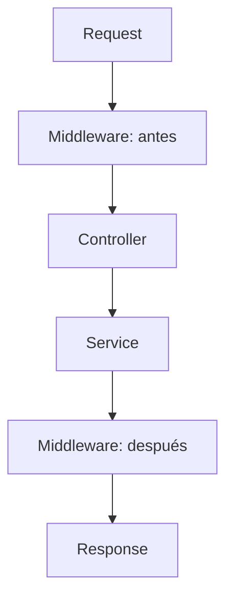

# Lab04 — Middleware

## Objetivo

Observar el pipeline HTTP con un middleware inline en `Program.cs`, manteniendo `GET /api/hola`, DI y Options de Lab03 sobre .NET 10.

## Pipeline HTTP



Los dos bloques Middleware representan el **mismo componente**. El servicio retorna al controller, ASP.NET Core ejecuta su resultado HTTP y luego vuelve al middleware. `docs/pipeline.mmd` contiene la copia para el preview del IDE.

## Conceptos nuevos

- `HttpContext`: contexto de una petición; expone `Request`, `Response` y otros datos asociados.
- `RequestDelegate`: delegado con firma `Task RequestDelegate(HttpContext context)`; representa procesamiento HTTP asíncrono.
- `app.Use(...)`: agrega un middleware que puede hacer trabajo alrededor del siguiente componente.
- En la sobrecarga usada, `next` es un `Func<Task>` ya asociado al contexto. `await next()` ejecuta y espera el resto del pipeline. Otra sobrecarga recibe un `RequestDelegate` y se invoca con `await next(context)`.

El log anterior a `await next()` ocurre antes del controller porque todavía no se delegó el procesamiento. El log posterior ocurre cuando el pipeline siguiente termina; entonces se lee el status de la respuesta.

## Comparación con Java/Spring

Un Servlet Filter que llama a `FilterChain.doFilter(...)` ofrece una referencia cercana para envolver el procesamiento antes y después. Los interceptors de Spring MVC y los filtros de acciones de ASP.NET Core operan alrededor de MVC; el middleware participa en el pipeline HTTP general. No son equivalencias exactas.

## Importancia del orden

Los middleware se encadenan en orden de registro y regresan en orden inverso. Si uno no llama a `next`, los componentes siguientes no se ejecutan. Aquí el middleware envuelve la ejecución de los endpoints y también observa peticiones sin ruta, que terminan en 404.

`MapControllers()` registra endpoints; su posición textual no representa otro `Use`. `WebApplication` incorpora automáticamente routing y ejecución de endpoints. El orden entre llamadas `Use` sí define su encadenamiento.

## Use vs Run vs Map

| API | Papel |
| --- | --- |
| `Use(...)` | Agrega middleware con acceso a `next`. |
| `Run(RequestDelegate)` | Agrega middleware terminal, sin `next`. |
| `Map("/prefijo", rama)` | Crea una rama del pipeline por prefijo de path. |
| `MapControllers()` / `MapGet(...)` | Registra endpoints en el routing. |

El `app.Run()` **sin delegado** al final de este laboratorio inicia el host; es una sobrecarga diferente de `Run(RequestDelegate)`.

## Cómo ejecutar

Desde la raíz, con el SDK .NET 10:

```powershell
cd Lab04-Middleware
dotnet run
```

Escucha en `http://localhost:5084`, en Development. Detener con `Ctrl+C`.

## Cómo probar

En otra terminal:

```powershell
curl.exe -i http://localhost:5084/api/hola
curl.exe -i http://localhost:5084/no-existe
```

El saludo devuelve HTTP 200 y JSON:

```json
{"mensaje":"Hola desde Development (dotnet-modern-refresh)"}
```

En la consola del servidor, entre los logs del framework:

```text
[Middleware antes] GET /api/hola
... ejecución del controller ...
[Middleware después] HTTP 200
```

La segunda petición muestra `GET /no-existe` antes y `HTTP 404` después. OpenAPI sigue en `/openapi/v1.json` durante Development.

## Documentación oficial de Microsoft

- [Middleware, orden y ramas del pipeline](https://learn.microsoft.com/en-us/aspnet/core/fundamentals/middleware/?view=aspnetcore-10.0)
- [RequestDelegate](https://learn.microsoft.com/en-us/dotnet/api/microsoft.aspnetcore.http.requestdelegate?view=aspnetcore-10.0)
- [Sobrecargas de Use](https://learn.microsoft.com/en-us/dotnet/api/microsoft.aspnetcore.builder.useextensions.use?view=aspnetcore-10.0)
- [Routing y endpoints](https://learn.microsoft.com/en-us/aspnet/core/fundamentals/routing?view=aspnetcore-10.0)
