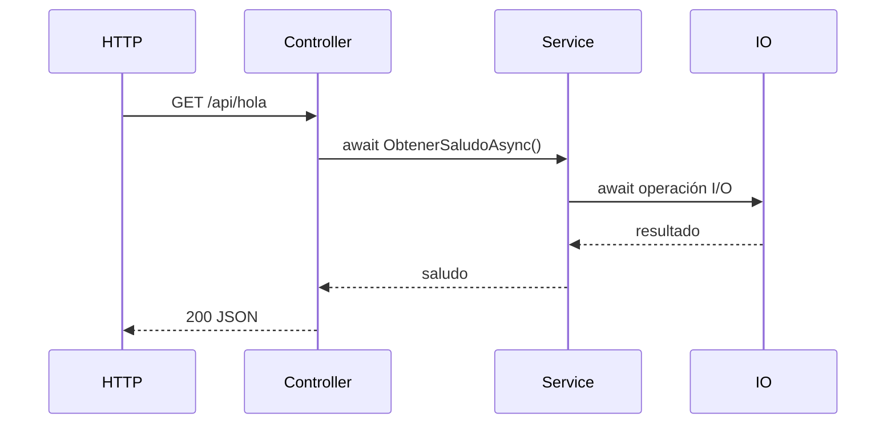

# Lab05 — Async/Await

## Objetivo

Propagar async/await desde `HolaService` hasta `HolaController`, manteniendo `GET /api/hola`, DI, configuración y middleware de Lab04 sobre .NET 10.

## Conceptos nuevos

- `Task`: representa la finalización de una operación, sin valor de resultado.
- `Task<T>`: añade un resultado de tipo `T`; esperar `Task<string>` con `await` entrega un `string`.
- `async`: permite usar `await` y al compilador generar el mecanismo de suspensión y continuación.
- `await`: espera la finalización sin bloquear el thread que ejecuta el método.
- Sufijo `Async`: convención para métodos asíncronos; no cambia la ruta HTTP.

La interfaz declara `Task<string>`; el modificador `async` pertenece a la implementación. El controller también devuelve una tarea: `Task<ActionResult>`.

## Flujo async



Aquí IO es **solo una simulación didáctica** con `await Task.Delay(250)`: un temporizador, sin acceso a recursos externos. En una aplicación real se esperaría acceso a base de datos, llamadas HTTP, lectura/escritura de archivos u otros recursos I/O.

El middleware sigue envolviendo el controller con `await next()`. Cada capa espera la tarea de la siguiente; ASP.NET Core espera la acción antes de ejecutar su resultado HTTP.

## Qué ocurre durante await

El método ejecuta código hasta encontrar una tarea pendiente. Entonces registra cómo continuar, se suspende y devuelve control al llamador. Cuando la cadena devuelve control al servidor, el thread del pool queda disponible para otro trabajo durante la espera. Al completarse la tarea, continúa desde el `await`; puede hacerlo en otro thread. Si la tarea ya terminó, no hace falta suspenderse.

## Async no implica nuevo thread

`async` y `await` no crean por sí mismos un thread. Una tarea representa una operación, no un thread dedicado. La espera del temporizador no mantiene un thread bloqueado; marcar un método `async` tampoco convierte automáticamente código bloqueante en asíncrono.

## I/O-bound vs CPU-bound

I/O-bound espera recursos externos; el await de APIs asíncronas permite aprovechar esa espera. CPU-bound realiza cálculos y consume CPU mientras trabaja. Agregar `async` no reduce ese costo ni vuelve paralelo un cálculo.

## Por qué evitar .Result y .Wait()

Bloquean el thread hasta completar la tarea. En ASP.NET Core esto reduce capacidad de atender peticiones y puede agotar el pool bajo carga. Mantener `await` en las capas que consumen operaciones asíncronas evita convertir la espera en bloqueo.

## Comparación breve con Java

`CompletableFuture<T>` es una referencia conceptual para representar un resultado futuro y encadenar continuaciones; C# permite expresarlas mediante `await`. En el modelo Servlet tradicional con I/O bloqueante, un thread por petición permanece ocupado durante la espera. ASP.NET Core con I/O asíncrono no necesita reservar ese thread mientras espera. No son equivalencias internas 1:1.

## Cómo ejecutar

Desde la raíz, con el SDK .NET 10:

```powershell
cd Lab05-AsyncAwait
dotnet run
```

Development en `http://localhost:5085`. Detener con `Ctrl+C`.

## Cómo probar

En otra terminal:

```powershell
curl.exe -i http://localhost:5085/api/hola
```

Tras una espera simulada de unos 250 ms, devuelve HTTP 200 y JSON:

```json
{"mensaje":"Hola desde Development (dotnet-modern-refresh)"}
```

La consola conserva el log antes del controller y el status 200 después. OpenAPI continúa en `/openapi/v1.json` durante Development.

## Archivos importantes

- `Services/IHolaService.cs`: contrato `Task<string>`.
- `Services/HolaService.cs`: `async`, espera simulada y saludo configurado.
- `Controllers/HolaController.cs`: `await` del servicio y `Task<ActionResult>`.
- `Program.cs`: mismo registro scoped, Options y middleware de Lab04.
- `appsettings*.json`, `Configuration/SaludoOptions.cs` y `Properties/launchSettings.json`: configuración conservada; puerto 5085.
- `docs/async.mmd`: copia del diagrama para el preview del IDE.

## Documentación oficial de Microsoft

- [Modelo async/await y tareas](https://learn.microsoft.com/en-us/dotnet/csharp/asynchronous-programming/task-asynchronous-programming-model)
- [Escenarios I/O-bound y CPU-bound](https://learn.microsoft.com/en-us/dotnet/csharp/asynchronous-programming/async-scenarios)
- [Evitar bloqueos en ASP.NET Core](https://learn.microsoft.com/en-us/aspnet/core/fundamentals/best-practices?view=aspnetcore-10.0)
- [Task.Delay](https://learn.microsoft.com/en-us/dotnet/api/system.threading.tasks.task.delay?view=net-10.0)
