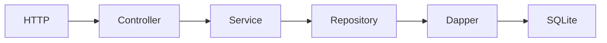

# Lab06a — Dapper

## Objetivo

Iniciar Lab06-DataAccess consultando clientes reales con SQLite, Repository y métodos async de Dapper sobre .NET 10, sin servidor de base de datos.

## Arquitectura



El middleware de Lab04 sigue envolviendo los endpoints. El controller decide la respuesta HTTP, el service delega la consulta y el repository concentra conexión, SQL y mapping. El service es deliberadamente pequeño en este caso de lectura.

## Conceptos nuevos

- `IClienteRepository` expresa operaciones de acceso a clientes; `ClienteRepository` implementa cómo obtenerlos.
- `SqliteConnection` conecta al archivo local. Se crea y abre en cada método; el bloque `using` la cierra con `Dispose` al salir, después del `await`.
- `QueryAsync<Cliente>` materializa una colección; Dapper asocia columnas `Id`, `Nombre`, `Email` a propiedades del modelo.
- `QuerySingleOrDefaultAsync<Cliente>` devuelve una fila o `null`; si hubiera más de una, falla. `Id` es clave primaria.
- `WHERE Id = @Id` recibe el valor mediante `new { Id = id }`, separado del SQL.
- Service y repository son **Scoped**: una instancia por petición. El registro del repository usa una fábrica para pasar la cadena de conexión; la conexión dura solamente la consulta.

**Async con SQLite:** ahora hay acceso real a datos y propagación de tareas entre capas. Sin embargo, `Microsoft.Data.Sqlite` ejecuta sus métodos async de forma síncrona: este proveedor no demuestra liberación del thread durante I/O. Conservamos las APIs async de Dapper para aprender su contrato, sin simular esperas.

## Por qué Dapper

Permite escribir SQL explícito y reduce el trabajo de ejecutar comandos, pasar parámetros y convertir filas a objetos. La consulta queda visible en el repository.

## Comparación conceptual con JdbcTemplate/JDBC

La conexión recuerda a JDBC; Dapper cumple un papel cercano a JdbcTemplate al simplificar ejecución y mapping. Aquí el mapping simple lo hace Dapper por nombres, sin escribir un RowMapper. Estas comparaciones no implican el mismo manejo interno de conexiones o asincronía.

## Flujo de una consulta

Controller → service → repository: abrir conexión → ejecutar SQL parametrizado → mapear resultado → cerrar conexión → devolver JSON. Los resultados de `QueryAsync` quedan materializados antes del cierre; el `return await` permite finalizar la consulta dentro del bloque `using`.

## Cómo ejecutar

Desde la raíz, con el SDK .NET 10:

```powershell
cd Lab06a-Dapper
dotnet run
```

Escucha en `http://localhost:5086`. Al arrancar crea la tabla y agrega tres clientes; repetir el arranque no duplica ni sobrescribe los registros existentes. Detener con `Ctrl+C`.

## Cómo probar ambos endpoints

En otra terminal:

```powershell
curl.exe -i http://localhost:5086/api/clientes
curl.exe -i http://localhost:5086/api/clientes/1
curl.exe -i http://localhost:5086/api/clientes/999
```

Los primeros devuelven HTTP 200: una colección y un objeto, respectivamente. El cliente 1:

```json
{"id":1,"nombre":"Ana García","email":"ana@example.com"}
```

Un Id inexistente devuelve 404. OpenAPI permanece en `/openapi/v1.json` durante Development.

## Dónde queda la base SQLite

`Lab06a-Dapper/Data/clientes.db`, bajo el content root del proyecto. `Program.cs` construye una ruta absoluta para la conexión. El archivo persiste entre ejecuciones y está excluido de Git junto a sus archivos auxiliares.

## Archivos importantes

- `Models/Cliente.cs`: propiedades que reciben el mapping.
- `Repositories/IClienteRepository.cs` y `ClienteRepository.cs`: contrato, conexión, SQL, parámetros y métodos async.
- `Services/IClienteService.cs` y `ClienteService.cs`: contrato y delegación al repository.
- `Controllers/ClientesController.cs`: colección, cliente por Id y respuesta 404.
- `Program.cs`: DI scoped, ubicación de la base, inicialización SQL y middleware.
- `Lab06a-Dapper.csproj`: paquetes Dapper y proveedor SQLite, además de OpenAPI.
- `docs/datos.mmd`: copia del diagrama para el IDE.

## Documentación oficial

- [Microsoft.Data.Sqlite](https://learn.microsoft.com/en-us/dotnet/standard/data/sqlite/)
- [Limitaciones async de SQLite](https://learn.microsoft.com/en-us/dotnet/standard/data/sqlite/async)
- [DI y lifetimes en ASP.NET Core](https://learn.microsoft.com/en-us/aspnet/core/fundamentals/dependency-injection?view=aspnetcore-10.0)
- [Dapper: documentación del proyecto](https://github.com/DapperLib/Dapper)
- [Dapper: APIs async](https://github.com/DapperLib/Dapper/blob/main/Dapper/SqlMapper.Async.cs)
