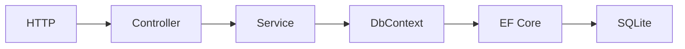

# Lab06b — EF Core

## Objetivo

Resolver los mismos endpoints y clientes de Lab06a con EF Core 10 y SQLite, usando `AppDbContext` directamente desde el service.

## Arquitectura



El middleware conserva los logs antes y después de los endpoints. `docs/datos.mmd` contiene la copia del diagrama para el IDE.

## Conceptos nuevos

`Cliente` es una entidad incluida en el modelo mediante `DbSet<Cliente>`. Por convención, `Id` es clave primaria, la tabla se llama `Clientes` y las propiedades se mapean a columnas. No hace falta configurar este mapping simple.

`AddDbContext<AppDbContext>(options => options.UseSqlite(...))` registra el contexto y el proveedor SQLite en DI. Controller y service mantienen sus contratos HTTP y de lectura de Lab06a.

## DbContext

`AppDbContext` coordina consultas, mapping, tracking y persistencia. Recibe `DbContextOptions<AppDbContext>` por constructor y el service recibe el contexto por DI.

`AddDbContext` usa **Scoped** por defecto: una instancia por petición HTTP, liberada por DI al terminar. EF Core gestiona la apertura y cierre de conexiones según las operaciones; el lifetime del contexto no significa una conexión abierta durante toda la petición. La inicialización usa un scope propio antes de arrancar el servidor.

## DbSet

`Clientes` es el punto de entrada para consultar entidades y registrar altas. No es una lista con todos los clientes ya cargados: la consulta se ejecuta al materializar sus resultados.

## Change Tracking

Las consultas de este laboratorio usan tracking por defecto. EF conserva las entidades materializadas y sus estados en el contexto para detectar modificaciones cuando se llama a `SaveChangesAsync()`.

En la inicialización, `AddRange` marca clientes como nuevos y `SaveChangesAsync` genera los INSERT. Los endpoints solamente leen; no necesitan guardar cambios. El tracking termina con el contexto.

## LINQ → SQL

`OrderBy` construye la consulta; `ToListAsync()` la ejecuta y materializa la lista. `SingleOrDefaultAsync(cliente => cliente.Id == id)` genera el filtro SQL parametrizado y devuelve una entidad o `null`.

La categoría `Microsoft.EntityFrameworkCore.Database.Command` está habilitada a Information en `Program.cs`: observar SELECT, WHERE y ORDER BY en la consola. No todo código C# es traducible a SQL.

Las APIs son async, pero se mantiene la limitación de Lab06a: el proveedor `Microsoft.Data.Sqlite` ejecuta las operaciones de I/O de forma síncrona.

## Comparación directa con Lab06a-Dapper

| Responsabilidad | Lab06a — Dapper | Lab06b — EF Core |
| --- | --- | --- |
| Acceso desde el service | `IClienteRepository` | `AppDbContext` |
| Consulta | SQL escrito en el repository | LINQ traducido a SQL por EF |
| Conexión | Apertura explícita y `using` | Gestionada por EF para sus operaciones |
| Materialización | Mapping de columnas por Dapper | Mapping de entidades por el modelo EF |
| Tracking | Los objetos consultados no se rastrean | Entidades rastreadas por defecto |
| Inicialización | SQL CREATE e INSERT explícito | Modelo, `EnsureCreatedAsync` y `SaveChangesAsync` |

Se conservan SQLite, los datos iniciales y las respuestas HTTP. EF asume además la traducción de consultas y la generación de comandos para persistir cambios.

## EnsureCreated vs migrations

`EnsureCreatedAsync()` crea la base y el esquema si hace falta; no evoluciona un esquema existente ni mantiene un historial de migrations. Aquí sirve para el laboratorio introductorio.

**No es la estrategia habitual para evolucionar el esquema de una aplicación real.** Migrations se verá posteriormente; no debe mezclarse sin más con una base inicializada mediante EnsureCreated.

## Cómo ejecutar

Desde la raíz, con el SDK .NET 10:

```powershell
cd Lab06b-EFCore
dotnet run
```

Development en `http://localhost:5087`. La base es `Lab06b-EFCore/Data/clientes.db`, independiente de Lab06a y excluida de Git. Si la tabla está vacía, el arranque agrega los mismos tres clientes. Reiniciar conserva los datos sin duplicarlos. Detener con `Ctrl+C`.

## Cómo probar

En otra terminal:

```powershell
curl.exe -i http://localhost:5087/api/clientes
curl.exe -i http://localhost:5087/api/clientes/1
curl.exe -i http://localhost:5087/api/clientes/999
```

Lista y cliente existente devuelven 200; el Id inexistente devuelve 404. Para el cliente 1:

```json
{"id":1,"nombre":"Ana García","email":"ana@example.com"}
```

Comparar el LINQ de `ClienteService.cs` con el SQL registrado en consola y con el repository de Lab06a. OpenAPI sigue en `/openapi/v1.json` durante Development.

## Archivos importantes

- `Models/Cliente.cs`: entidad y mapping por convención.
- `Data/AppDbContext.cs`: contexto, options y `DbSet<Cliente>`.
- `Services/IClienteService.cs` y `ClienteService.cs`: contrato y consultas LINQ async.
- `Controllers/ClientesController.cs`: mismos endpoints y respuestas que Lab06a.
- `Program.cs`: proveedor SQLite, DI scoped, log SQL, inicialización y middleware.
- `Lab06b-EFCore.csproj`: paquete EF Core SQLite y OpenAPI.

## Documentación oficial de Microsoft

- [DbContext, configuración y DI](https://learn.microsoft.com/en-us/ef/core/dbcontext-configuration/)
- [Entidades y convenciones](https://learn.microsoft.com/en-us/ef/core/modeling/entity-types)
- [Consultas LINQ](https://learn.microsoft.com/en-us/ef/core/querying/)
- [Change Tracking](https://learn.microsoft.com/en-us/ef/core/change-tracking/)
- [Consultas async](https://learn.microsoft.com/en-us/ef/core/miscellaneous/async)
- [EnsureCreated](https://learn.microsoft.com/en-us/ef/core/managing-schemas/ensure-created)
- [Logging integrado](https://learn.microsoft.com/en-us/ef/core/logging-events-diagnostics/extensions-logging)
- [Limitaciones async de SQLite](https://learn.microsoft.com/en-us/dotnet/standard/data/sqlite/async)
