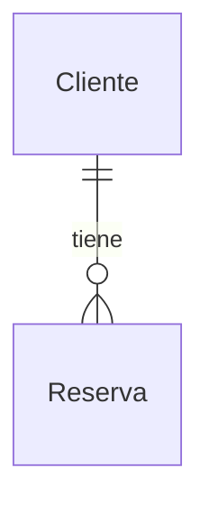

# Lab06c — EF Core: relaciones y migrations

## Objetivo

Crear reservas de clientes existentes con EF Core 10 y SQLite, observando relaciones, tracking y migrations. Se mantiene Controller → Service → AppDbContext.

## Conceptos nuevos

Entidad `Reserva`, navegación bidireccional 1:N, foreign key, `Include`, `Add`, `SaveChangesAsync` y esquema versionado mediante migrations. El middleware y el log SQL de Lab06b se conservan.

`CrearReservaRequest` es un DTO de entrada con `ClienteId`, `Fecha` y `Estado`. Evita aceptar el Id generado o un grafo de entidades/navegaciones enviado por el consumidor; el service crea explícitamente la entidad.

## Relación Cliente/Reserva



- `Cliente.Reservas`: colección de reservas del cliente; puede estar vacía.
- `Reserva.Cliente`: referencia al cliente de esa reserva.
- `Reserva.ClienteId`: foreign key persistida que referencia `Cliente.Id`.

EF descubre la colección y la referencia como las dos navegaciones de una relación 1:N, y reconoce `ClienteId` por nombre y tipo. Al ser `int` no nullable, cada reserva requiere un cliente. La migration crea la FK y su índice por convención.

`Include(reserva => reserva.Cliente)` carga al cliente con las reservas: observar el JOIN en consola. `[JsonIgnore]` en `Cliente.Reservas` corta el ciclo JSON Reserva → Cliente → Reservas, conservando el mapping EF. Los GET de clientes mantienen su JSON anterior; los GET de reservas incluyen Id, Nombre y Email del cliente.

## Change Tracking

El cliente se consulta y queda tracked como `Unchanged`. Al agregar la reserva, EF rastrea esa entidad como `Added`; el cliente existente no se inserta otra vez. `SaveChangesAsync` escribe la reserva, actualiza su Id y la deja `Unchanged`.

## Flujo Add → SaveChanges

Mirar `Services/ReservaService.cs`: crear `new Reserva`, llamar `_db.Reservas.Add(reserva)`, consultar `_db.Entry(reserva).State` y ejecutar `await _db.SaveChangesAsync()`.

La consola muestra, por ejemplo:

```text
[Tracking antes de SaveChanges] Estado=Added, Id=0
[Tracking después de SaveChanges] Estado=Unchanged, Id=1
```

El Id de la segunda línea lo genera SQLite; puede ser otro según los datos existentes. EF puede mantener una clave temporal internamente antes de guardar. Se conserva la limitación async del proveedor SQLite explicada en Lab06b.

## Migrations

`Migrations/` contiene la migration inicial generada por la CLI: `Up` aplica las operaciones de esquema y `Down` permite revertirlas. El archivo Designer aporta metadatos; `AppDbContextModelSnapshot` representa el modelo de referencia.

Se versionan junto al código para reproducir la evolución del esquema. Al generar otra migration, EF compara el modelo actual con el snapshot anterior, no con el esquema vivo de SQLite. `__EFMigrationsHistory` registra las migrations aplicadas a cada base.

## EnsureCreated vs migrations

Lab06b creaba el esquema inicial sin historial de evolución. Este laboratorio usa migrations para crear y evolucionar el esquema; no llama a `EnsureCreatedAsync`. Tiene su propia base local, independiente de la base de Lab06b.

## Comandos dotnet ef

La herramienta local está fijada en `.config/dotnet-tools.json`; el proyecto referencia `Microsoft.EntityFrameworkCore.Design`.

Desde la carpeta del laboratorio, los comandos usados para generar y aplicar el esquema son:

```powershell
dotnet tool restore
dotnet ef migrations add InitialCreate
dotnet ef database update
```

`InitialCreate` ya está incluida: no volver a generarla al ejecutar el laboratorio. Después de cambiar el modelo, una nueva migration se genera con otro nombre y se revisa antes de aplicarla.

## Cómo ejecutar

Desde la raíz, con el SDK .NET 10:

```powershell
cd Lab06c-EFCore-Relations-Migrations
dotnet tool restore
dotnet ef database update
dotnet run
```

Development en `http://localhost:5088`. La base queda en `Data/clientes.db` dentro del proyecto y está excluida de Git. El arranque agrega tres clientes si la tabla está vacía; las reservas se crean mediante POST y persisten. Detener con `Ctrl+C`.

## Cómo probar GET y POST

En otra terminal:

```powershell
curl.exe -i http://localhost:5088/api/clientes
curl.exe -i http://localhost:5088/api/clientes/1
curl.exe -i http://localhost:5088/api/reservas

$body = '{"clienteId":1,"fecha":"2026-10-05T10:00:00","estado":"Pendiente"}'
$reserva = Invoke-RestMethod -Method Post -Uri http://localhost:5088/api/reservas -ContentType application/json -Body $body
$reserva
curl.exe -i "http://localhost:5088/api/reservas/$($reserva.id)"
curl.exe -i http://localhost:5088/api/reservas
```

GET devuelve 200; el POST devuelve **201**, Id generado y `Location` hacia el GET individual. La respuesta contiene la reserva y su cliente, sin ciclos JSON. Un Id inexistente devuelve 404; POST con un `ClienteId` inexistente devuelve 404 sin insertar. Observar los logs de tracking e INSERT, y luego el JOIN de los GET. OpenAPI sigue en `/openapi/v1.json` durante Development.

## Documentación oficial de Microsoft

- [Convenciones para relaciones y foreign keys](https://learn.microsoft.com/en-us/ef/core/modeling/relationships/conventions)
- [Carga de navegaciones con Include](https://learn.microsoft.com/en-us/ef/core/querying/related-data/eager)
- [Tracking, Add y claves generadas](https://learn.microsoft.com/en-us/ef/core/change-tracking/explicit-tracking)
- [Relaciones y serialización](https://learn.microsoft.com/en-us/ef/core/querying/related-data/serialization)
- [Migrations](https://learn.microsoft.com/en-us/ef/core/managing-schemas/migrations/)
- [Archivos y snapshot de migrations](https://learn.microsoft.com/en-us/ef/core/managing-schemas/migrations/managing)
- [Comandos dotnet ef](https://learn.microsoft.com/en-us/ef/core/cli/dotnet)
