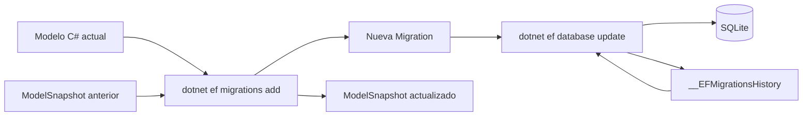

# Lab06c.1 — EF Core Migrations paso a paso

## Objetivo

Este documento registra el proceso realizado en el **Lab06c-EFCore-Relations-Migrations** para entender qué hace Entity Framework Core cuando evoluciona el esquema de una base de datos.

El cambio fue deliberadamente pequeño: agregar `Telefono` a `Cliente` y observar cada paso, desde el modelo C# hasta el `ALTER TABLE` ejecutado sobre SQLite.

La idea central es quitarle “magia” a Migrations y distinguir claramente:

- el modelo C# actual;
- las migrations versionadas en el proyecto;
- el `ModelSnapshot`;
- el estado real de la base de datos;
- las migrations que la base ya tiene aplicadas.

---

## 1. Herramienta CLI de Entity Framework Core

El laboratorio utiliza la herramienta de línea de comandos de EF Core:

```powershell
dotnet ef
```

Esta herramienta **no es lo mismo que las librerías de EF Core usadas por la aplicación**. Es tooling de desarrollo que permite, entre otras cosas:

- inspeccionar el `DbContext`;
- crear migrations;
- listar migrations;
- aplicar migrations a una base de datos.

### `.config/dotnet-tools.json`

El proyecto contiene un manifiesto local de herramientas, normalmente:

```text
.config/
└── dotnet-tools.json
```

En nuestro caso declara `dotnet-ef` versión `10.0.12`.

El objetivo de este archivo es que la herramienta y su versión formen parte de la configuración reproducible del proyecto. Otro desarrollador que clone el repositorio no necesita adivinar qué versión instalar.

### Restaurar las herramientas

Desde el directorio del Lab06c ejecutamos:

```powershell
dotnet tool restore
```

Resultado:

```text
Se restauró la herramienta "dotnet-ef" (versión "10.0.12").
Comandos disponibles: dotnet-ef
```

Este comando **no modifica la base de datos y no crea migrations**. Solamente restaura las herramientas declaradas en `dotnet-tools.json`.

Luego verificamos:

```powershell
dotnet ef
```

EF mostró sus comandos principales:

```text
database
DbContext
migrations
```

> Importante: hay que ejecutar `dotnet tool restore` desde un directorio desde el cual .NET pueda encontrar el manifiesto. La búsqueda se realiza desde el directorio actual hacia sus padres; no recorre arbitrariamente los subdirectorios del repositorio.

---

## 2. Estado inicial de las migrations

Antes de modificar el modelo ejecutamos:

```powershell
dotnet ef migrations list
```

EF compiló primero el proyecto y luego consultó SQLite:

```sql
SELECT COUNT(*)
FROM "sqlite_master"
WHERE "name" = '__EFMigrationsHistory'
  AND "type" = 'table';
```

Después consultó:

```sql
SELECT "MigrationId", "ProductVersion"
FROM "__EFMigrationsHistory"
ORDER BY "MigrationId";
```

El resultado fue:

```text
20261004231722_InitialCreate
```

Esto confirma dos cosas:

1. el proyecto contiene una migration llamada `InitialCreate`;
2. esa migration ya está registrada como aplicada en la base SQLite.

### `__EFMigrationsHistory`

EF Core mantiene en la propia base una tabla especial:

```text
__EFMigrationsHistory
```

Su función es registrar **qué migrations ya fueron aplicadas físicamente a esa base de datos**.

Por eso EF puede ejecutar repetidamente:

```powershell
dotnet ef database update
```

sin volver a aplicar migrations ya ejecutadas.

---

## 3. Cambio en el modelo: agregar `Telefono`

Modificamos la entidad `Cliente` agregando:

```csharp
public string? Telefono { get; set; }
```

El `?` es importante: indica que `Telefono` puede ser `null`.

El modelo pasó conceptualmente de:

```text
Cliente
├── Id
├── Nombre
└── Email
```

a:

```text
Cliente
├── Id
├── Nombre
├── Email
└── Telefono
```

En este momento **solamente cambió el código C#**. SQLite todavía no tenía una columna `Telefono`.

---

## 4. Crear una migration

Ejecutamos:

```powershell
dotnet ef migrations add AgregarTelefonoCliente
```

`AgregarTelefonoCliente` es un **nombre elegido por el desarrollador**. Conviene que describa el cambio realizado.

Otros nombres razonables podrían ser:

```text
AgregarEstadoReserva
CrearTablaServicios
RelacionarReservaConServicio
```

El nombre no determina el contenido de la migration. EF calcula el cambio comparando su modelo anterior conocido con el modelo actual.

### EF hace un build antes de trabajar

La primera ejecución falló porque la aplicación estaba ejecutándose en otra terminal y el build no pudo completarse.

EF informó:

```text
Build started...
Build failed. Use dotnet build to see the errors.
```

Esto deja una regla útil:

> `dotnet ef` necesita poder compilar el proyecto para construir el modelo de EF Core.

Una vez detenida la aplicación, repetimos:

```powershell
dotnet ef migrations add AgregarTelefonoCliente
```

Resultado:

```text
Build started...
Build succeeded.
Done. To undo this action, use 'ef migrations remove'
```

Todavía **no se modificó SQLite**. EF solamente generó los artefactos que describen el cambio.

---

## 5. Archivos generados por una migration

Después de crear la migration aparecieron/modificaron tres piezas importantes.

### 5.1 `<timestamp>_AgregarTelefonoCliente.cs`

Ejemplo:

```text
20261004235706_AgregarTelefonoCliente.cs
```

Es el archivo principal de la migration. Describe **el cambio** entre el modelo anterior y el nuevo.

Contiene dos métodos fundamentales.

### `Up()`

Describe cómo avanzar hacia esta versión:

```csharp
protected override void Up(MigrationBuilder migrationBuilder)
{
    migrationBuilder.AddColumn<string>(
        name: "Telefono",
        table: "Clientes",
        type: "TEXT",
        nullable: true);
}
```

EF detectó correctamente que:

```csharp
public string? Telefono { get; set; }
```

corresponde en SQLite a una columna:

```text
TEXT NULL
```

### `Down()`

Describe cómo revertir esta migration:

```csharp
protected override void Down(MigrationBuilder migrationBuilder)
{
    migrationBuilder.DropColumn(
        name: "Telefono",
        table: "Clientes");
}
```

Conceptualmente:

```text
Up()   → aplicar el cambio
Down() → deshacer el cambio
```

---

### 5.2 `<timestamp>_AgregarTelefonoCliente.Designer.cs`

Ejemplo:

```text
20261004235706_AgregarTelefonoCliente.Designer.cs
```

Contiene metadata generada por EF asociada a **esa migration específica** y al modelo que representa.

En una primera aproximación:

- debemos saber para qué existe;
- normalmente no lo editamos manualmente;
- EF lo mantiene como parte de los artefactos de migrations.

No es el archivo principal para entender qué cambio se aplicará; para eso miramos primero `AgregarTelefonoCliente.cs`.

---

### 5.3 `AppDbContextModelSnapshot.cs`

El Snapshot representa **el estado completo del modelo que EF considera alcanzado por la última migration generada**.

Después de agregar `Telefono`, encontramos allí una representación equivalente a:

```csharp
b.Property<string>("Telefono")
    .HasColumnType("TEXT");
```

La diferencia conceptual es fundamental:

```text
Migration
└── describe EL CAMBIO
    "agregar Telefono"

ModelSnapshot
└── describe EL MODELO RESULTANTE
    "Cliente tiene Id, Nombre, Email, Telefono..."
```

Cuando creemos una migration futura, EF podrá comparar conceptualmente:

```text
ModelSnapshot anterior
        │
        ├──── comparar ──── Modelo C# actual
        │
        ▼
 detectar diferencias
        │
        ▼
 generar nueva migration
```

---

## 6. Migration generada no significa migration aplicada

Después de generar `AgregarTelefonoCliente`, ejecutamos nuevamente:

```powershell
dotnet ef migrations list
```

Resultado:

```text
20261004231722_InitialCreate
20261004235706_AgregarTelefonoCliente (Pending)
```

`Pending` significa que la migration existe en el proyecto, pero **todavía no fue aplicada a la base de datos actual**.

En ese momento coexistían tres estados:

```text
Modelo C#        → Telefono existe
ModelSnapshot    → Telefono existe
SQLite real      → Telefono todavía NO existe
```

Esto es muy importante: `migrations add` genera la descripción/versionado del cambio; no modifica automáticamente la base.

---

## 7. Aplicar la migration

Ejecutamos:

```powershell
dotnet ef database update
```

EF realizó varios pasos.

### 7.1 Compiló el proyecto

```text
Build started...
Build succeeded.
```

### 7.2 Adquirió un lock de migrations

Apareció:

```text
Acquiring an exclusive lock for migration application.
```

Y EF utilizó:

```text
__EFMigrationsLock
```

El objetivo es evitar que dos procesos intenten aplicar migrations simultáneamente sobre la misma base.

Para este laboratorio basta con comprender su función; no necesitamos administrar manualmente esta tabla.

### 7.3 Consultó `__EFMigrationsHistory`

EF comprobó qué migrations ya estaban aplicadas.

Encontró:

```text
InitialCreate              → aplicada
AgregarTelefonoCliente     → pendiente
```

### 7.4 Aplicó `AgregarTelefonoCliente`

El log mostró:

```text
Applying migration '20261004235706_AgregarTelefonoCliente'.
```

Y el `AddColumn` generado en C# terminó convertido en SQL real para SQLite:

```sql
ALTER TABLE "Clientes" ADD "Telefono" TEXT NULL;
```

Este es el momento en que **la base de datos cambió físicamente**.

El recorrido fue:

```text
public string? Telefono
        ↓
migrationBuilder.AddColumn<string>(...)
        ↓
dotnet ef database update
        ↓
ALTER TABLE "Clientes" ADD "Telefono" TEXT NULL
```

### 7.5 Registró la migration como aplicada

Después del `ALTER TABLE`, EF ejecutó:

```sql
INSERT INTO "__EFMigrationsHistory" ("MigrationId", "ProductVersion")
VALUES ('20261004235706_AgregarTelefonoCliente', '10.0.12');
```

La base pasó a registrar:

```text
__EFMigrationsHistory
├── 20261004231722_InitialCreate
└── 20261004235706_AgregarTelefonoCliente
```

Por eso una nueva ejecución de:

```powershell
dotnet ef database update
```

no intentará volver a agregar la columna.

Finalmente EF liberó el lock:

```sql
DELETE FROM "__EFMigrationsLock";
```

---

## 8. Las cuatro piezas que no debemos confundir

### Modelo C#

Ejemplo:

```csharp
public class Cliente
{
    public int Id { get; set; }
    public string Nombre { get; set; }
    public string Email { get; set; }
    public string? Telefono { get; set; }
}
```

Representa **cómo queremos que sea actualmente nuestro modelo**.

### Migration

Ejemplo:

```text
20261004235706_AgregarTelefonoCliente.cs
```

Representa **un cambio versionado** entre dos estados del modelo.

### ModelSnapshot

```text
AppDbContextModelSnapshot.cs
```

Representa **el último estado completo del modelo conocido por el sistema de migrations**.

### `__EFMigrationsHistory`

Está dentro de la base de datos y representa **qué migrations fueron efectivamente aplicadas a esa base concreta**.

Una forma útil de recordarlo:



---

## 9. Comandos utilizados y responsabilidad de cada uno

```powershell
dotnet tool restore
```

Restaura las herramientas locales declaradas en `dotnet-tools.json`. No crea migrations ni modifica la BD.

```powershell
dotnet ef
```

Verifica/accede a la CLI de EF Core.

```powershell
dotnet ef migrations list
```

Lista las migrations conocidas y consulta la base para determinar cuáles están aplicadas o pendientes.

```powershell
dotnet ef migrations add AgregarTelefonoCliente
```

Compara el modelo actual con el estado anterior conocido por migrations y genera una nueva migration. No aplica el cambio a la BD.

```powershell
dotnet ef database update
```

Consulta qué migrations están pendientes y ejecuta sus `Up()` para llevar la base al estado correspondiente.

---

## 10. Secuencia completa realizada

```text
1. dotnet tool restore
       ↓
   restaura dotnet-ef 10.0.12

2. dotnet ef migrations list
       ↓
   InitialCreate ya aplicada

3. agregar a Cliente:
   public string? Telefono { get; set; }
       ↓
   sólo cambia el modelo C#

4. dotnet ef migrations add AgregarTelefonoCliente
       ↓
   EF compila
       ↓
   compara modelo anterior vs actual
       ↓
   genera Migration + Designer
       ↓
   actualiza ModelSnapshot

5. dotnet ef migrations list
       ↓
   AgregarTelefonoCliente (Pending)

6. inspeccionar Up() / Down()
       ↓
   AddColumn / DropColumn

7. dotnet ef database update
       ↓
   consulta __EFMigrationsHistory
       ↓
   detecta migration pendiente
       ↓
   ejecuta Up()
       ↓
   ALTER TABLE Clientes ADD Telefono TEXT NULL
       ↓
   registra migration en __EFMigrationsHistory
```

---

## Conclusión

EF Core Migrations no modifica la base simplemente porque cambiemos una clase C#.

Hay dos momentos claramente separados:

```text
CAMBIO DEL MODELO
      ↓
dotnet ef migrations add
      ↓
VERSIONADO/DESCRIPCIÓN DEL CAMBIO
```

Luego:

```text
Migration pendiente
      ↓
dotnet ef database update
      ↓
CAMBIO FÍSICO EN LA BASE
```

La separación permite que la evolución del esquema quede versionada junto con el código y que EF pueda determinar qué cambios conoce el proyecto y cuáles fueron realmente aplicados a cada base de datos.
