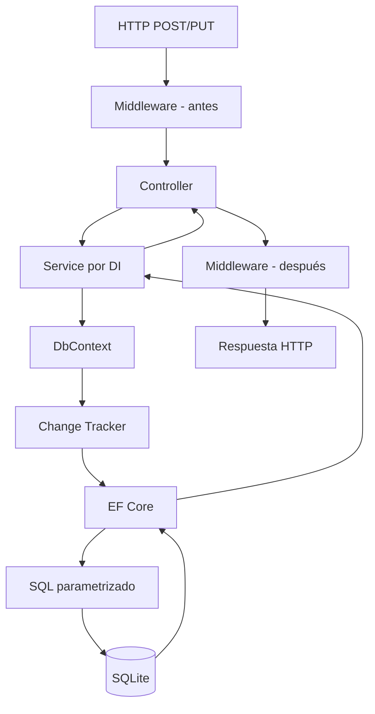

# Lab06c.2 — EF Core Change Tracking paso a paso

## Objetivo

Este documento registra los experimentos realizados en el **Lab06c-EFCore-Relations-Migrations** para entender el mecanismo de **Change Tracking** de Entity Framework Core.

Se observaron dos situaciones:

1. crear una nueva `Reserva` mediante `Add()` + `SaveChangesAsync()`;
2. recuperar una `Reserva`, modificar `Estado` y guardar el cambio **sin llamar a `Update()`**.

El objetivo no es solamente aprender la sintaxis, sino entender qué sabe el `DbContext`, cuándo se ejecuta realmente SQL y por qué EF puede determinar qué operación debe realizar.

---

## 1. ¿Qué es Change Tracking?

Cuando EF Core obtiene o incorpora determinadas entidades mediante un `DbContext`, puede mantener información sobre su estado.

Entre los estados más importantes están:

```text
Detached    → EF no está siguiendo la entidad
Unchanged   → está trackeada y no tiene cambios pendientes
Added       → debe insertarse
Modified    → tiene cambios que deben actualizarse
Deleted     → debe eliminarse
```

El `DbContext` utiliza esta información cuando ejecutamos:

```csharp
await db.SaveChangesAsync();
```

para decidir qué `INSERT`, `UPDATE` o `DELETE` debe enviar a la base.

---

# Parte I — Crear una Reserva

## 2. Flujo general

El POST utilizado fue conceptualmente:

```text
HTTP POST
   ↓
ReservasController
   ↓
ReservaService
   ↓
AppDbContext
   ↓
ChangeTracker
   ↓
EF Core
   ↓
SQLite
```

La prueba envió:

```json
{
  "clienteId": 2,
  "fecha": "2026-10-10T16:30:00",
  "estado": "Pendiente"
}
```

La respuesta fue:

```text
id        : 3
clienteId : 2
fecha     : 2026-10-10T16:30:00
estado    : Pendiente
cliente   : Bruno López
```

---

## 3. Primero EF verifica el Cliente

El log mostró:

```sql
SELECT "c"."Id", "c"."Email", "c"."Nombre", "c"."Telefono"
FROM "Clientes" AS "c"
WHERE "c"."Id" = @clienteId
LIMIT 2;
```

El servicio estaba creando una reserva para `clienteId = 2`, por lo que primero comprobó/obtuvo el cliente correspondiente.

Esto también explica que la respuesta pudiera incluir la navegación `Cliente` con Bruno López.

---

## 4. `Add()` no ejecuta el INSERT

Después de construir la nueva entidad se realizó conceptualmente:

```csharp
_db.Reservas.Add(reserva);
```

El log didáctico mostró:

```text
[Tracking antes de SaveChanges] Estado=Added, Id=0
```

En este punto:

```text
Objeto C# Reserva
├── Id = 0
├── ClienteId = 2
├── Fecha = 2026-10-10 16:30
└── Estado = Pendiente

DbContext / ChangeTracker
└── Reserva → Added

SQLite
└── la nueva fila todavía NO existe
```

La conclusión fundamental es:

> `Add()` incorpora la entidad al seguimiento del `DbContext` con estado `Added`; no significa que en ese instante se haya ejecutado el `INSERT`.

---

## 5. `SaveChangesAsync()` sincroniza los cambios

Luego se ejecutó:

```csharp
await _db.SaveChangesAsync();
```

EF inspeccionó las entidades trackeadas, encontró una `Reserva` con estado `Added` y generó:

```sql
INSERT INTO "Reservas" ("ClienteId", "Estado", "Fecha")
VALUES (@p0, @p1, @p2)
RETURNING "Id";
```

El `RETURNING "Id"` es especialmente importante.

SQLite genera el identificador de la nueva fila y EF pide que se lo devuelva inmediatamente.

Antes del guardado:

```text
reserva.Id = 0
```

Después:

```text
reserva.Id = 3
```

EF actualizó **el mismo objeto C# que estaba en memoria** con el ID generado por la base.

---

## 6. Estado después de guardar

El log mostró:

```text
[Tracking después de SaveChanges] Estado=Unchanged, Id=3
```

El ciclo completo fue:

```text
new Reserva
     ↓
Id = 0
     ↓
Add(reserva)
     ↓
ChangeTracker = Added
     ↓
SaveChangesAsync()
     ↓
INSERT ... RETURNING Id
     ↓
SQLite genera Id = 3
     ↓
EF actualiza reserva.Id = 3
     ↓
ChangeTracker = Unchanged
```

¿Por qué `Unchanged`?

Porque después del `SaveChangesAsync()` el objeto que EF está siguiendo y el registro persistido están nuevamente sincronizados. No queda ningún cambio pendiente.

---

## 7. HTTP 201 Created

Después de crear la reserva, el Controller devolvió un resultado `CreatedAtRouteResult`.

El log mostró:

```text
Executing CreatedAtRouteResult
[Middleware después] HTTP 201
```

`201 Created` es apropiado para un `POST` que creó un nuevo recurso.

Como EF ya recuperó el identificador generado (`Id = 3`), la API puede indicar conceptualmente que el nuevo recurso puede recuperarse mediante:

```text
GET /api/reservas/3
```

Esto explica la prueba utilizada anteriormente:

```powershell
$reserva = Invoke-RestMethod -Method Post ...
curl.exe -i "http://localhost:5088/api/reservas/$($reserva.id)"
```

---

# Parte II — Modificar una Reserva trackeada

## 8. Experimento

Para completar el concepto agregamos una operación que confirma una reserva.

El servicio realiza conceptualmente:

```csharp
var reserva = await _db.Reservas
    .SingleOrDefaultAsync(r => r.Id == id);

if (reserva is null)
    return null;

reserva.Estado = "Confirmada";

await _db.SaveChangesAsync();
```

Lo importante es lo que **no** aparece:

```csharp
_db.Reservas.Update(reserva);
```

No fue necesario llamar a `Update()` porque la entidad fue recuperada por ese `DbContext` y ya estaba siendo trackeada.

---

## 9. Estado inicial: `Unchanged`

La prueba invocó:

```text
PUT /api/reservas/3/confirmar
```

EF primero ejecutó:

```sql
SELECT "r"."Id", "r"."ClienteId", "r"."Estado", "r"."Fecha"
FROM "Reservas" AS "r"
WHERE "r"."Id" = @id
LIMIT 2;
```

Luego el log mostró:

```text
[Antes del cambio] Estado tracking=Unchanged, Estado reserva=Pendiente
```

Conceptualmente:

```text
Reserva recuperada desde SQLite
        ↓
DbContext comienza a seguirla
        ↓
Tracking = Unchanged
```

EF conoce los valores con los que la entidad fue materializada.

---

## 10. Modificar una propiedad

Se ejecutó simplemente:

```csharp
reserva.Estado = "Confirmada";
```

El siguiente log mostró:

```text
[Después del cambio] Estado tracking=Modified, Estado reserva=Confirmada
```

No ejecutamos SQL explícitamente y tampoco llamamos a `Update()`.

EF detectó que la entidad trackeada ya no coincide con su estado original.

Conceptualmente:

```text
Original                    Actual
────────────────────────────────────
Id          3               3
ClienteId   2               2
Fecha       ...             ...
Estado      Pendiente       Confirmada
                            ↑
                            cambió
```

Por eso la entidad pasó de:

```text
Unchanged → Modified
```

---

## 11. `SaveChangesAsync()` genera el UPDATE

Al ejecutar:

```csharp
await _db.SaveChangesAsync();
```

EF generó:

```sql
UPDATE "Reservas" SET "Estado" = @p0
WHERE "Id" = @p1
RETURNING 1;
```

Es especialmente interesante que actualizó **solamente `Estado`**.

No generó un UPDATE innecesario de todas las columnas como:

```sql
UPDATE Reservas
SET ClienteId = ...,
    Fecha = ...,
    Estado = ...
WHERE Id = ...;
```

El Change Tracker sabía qué propiedad había cambiado y EF produjo el SQL correspondiente.

---

## 12. Después del UPDATE vuelve a `Unchanged`

El log final mostró:

```text
[Después de SaveChanges] Estado tracking=Unchanged, Estado reserva=Confirmada
```

El ciclo fue:

```text
SELECT Reserva
      ↓
Unchanged
      ↓
reserva.Estado = "Confirmada"
      ↓
Modified
      ↓
SaveChangesAsync()
      ↓
UPDATE Estado
      ↓
BD y objeto vuelven a estar sincronizados
      ↓
Unchanged
```

---

## 13. ¿Por qué no hizo falta `Update()`?

Porque la entidad fue obtenida mediante el mismo `DbContext`:

```csharp
var reserva = await _db.Reservas
    .SingleOrDefaultAsync(r => r.Id == id);
```

EF ya la estaba siguiendo.

Cuando modificamos:

```csharp
reserva.Estado = "Confirmada";
```

el Change Tracker pudo detectar el cambio.

Por eso fue suficiente:

```csharp
await _db.SaveChangesAsync();
```

Esto **no significa que `Update()` nunca tenga utilidad**. Existen otros escenarios, por ejemplo entidades desconectadas, en los que el contexto no tiene ese seguimiento previo. Ese tema queda fuera del alcance de este laboratorio introductorio.

La conclusión concreta de este experimento es:

> Para una entidad recuperada y trackeada por el mismo `DbContext`, modificar sus propiedades y ejecutar `SaveChangesAsync()` puede ser suficiente para persistir los cambios.

---

## 14. `DbContext` y unidad de trabajo

Este laboratorio también permite entender mejor por qué no agregamos todavía un `UnitOfWork` propio.

Dentro de un `DbContext` pueden existir varias entidades con distintos estados:

```text
DbContext
└── ChangeTracker
    ├── Reserva A → Unchanged
    ├── Reserva B → Added
    ├── Cliente 1 → Modified
    └── Reserva C → Deleted
```

Cuando ejecutamos:

```csharp
await _db.SaveChangesAsync();
```

EF analiza los cambios pendientes y los sincroniza con la base.

En este sentido, `DbContext` ya cumple responsabilidades asociadas al seguimiento de entidades y a una unidad de trabajo.

---

## 15. Comparación con Dapper

La diferencia conceptual se ve claramente en la actualización de `Estado`.

### Dapper

Con Dapper normalmente expresaríamos directamente el SQL:

```sql
UPDATE Reservas
SET Estado = @Estado
WHERE Id = @Id;
```

El desarrollador decide explícitamente qué SQL ejecutar.

### EF Core

Con EF Core trabajamos con la entidad:

```csharp
reserva.Estado = "Confirmada";
await _db.SaveChangesAsync();
```

EF utiliza el Change Tracker y genera el SQL necesario.

Una simplificación útil:

```text
Dapper
Objeto + SQL explícito
       ↓
Base de datos

EF Core
Entidad + estado del DbContext
       ↓
EF determina SQL
       ↓
Base de datos
```

Esto no convierte a uno en universalmente mejor que el otro: representan niveles de abstracción y estilos de acceso a datos diferentes.

---

## 16. Mapa mental con JPA / Hibernate

Para alguien familiarizado con Java/JPA/Hibernate, estas aproximaciones sirven como mapa mental inicial:

| JPA / Hibernate | EF Core |
|---|---|
| `EntityManager` | `DbContext` |
| Persistence Context | `DbContext` / Change Tracker |
| entidad managed | entidad tracked |
| dirty checking | change detection |
| `persist()` | `Add()` (aproximadamente) |
| flush/commit | `SaveChanges()` / `SaveChangesAsync()` (aproximadamente) |

No son equivalencias exactas de implementación ni de ciclo de vida, pero ayudan a relacionar conceptos conocidos.

---

## 17. Cómo encajan los labs anteriores

El log completo de la operación muestra que las piezas estudiadas anteriormente empiezan a integrarse:



Podemos reconocer:

```text
Controllers        ← Lab01
Dependency Injection ← Lab02
Middleware         ← Lab04
async / await      ← Lab05
DbContext / EF     ← Lab06
Change Tracking    ← Lab06c
```

---

## 18. Resumen de los dos experimentos

### Alta

```text
new Reserva
   ↓
Add()
   ↓
Added / Id=0
   ↓
SaveChangesAsync()
   ↓
INSERT ... RETURNING Id
   ↓
Id generado
   ↓
Unchanged
```

### Modificación

```text
SELECT Reserva
   ↓
Unchanged
   ↓
modificar Estado
   ↓
Modified
   ↓
SaveChangesAsync()
   ↓
UPDATE sólo de Estado
   ↓
Unchanged
```

---

## Conclusión

La idea fundamental del Change Tracking es que EF Core puede mantener el estado de las entidades asociadas al `DbContext` y utilizar esa información para determinar qué cambios deben persistirse.

En nuestros experimentos comprobamos directamente que:

- `Add()` no ejecuta inmediatamente un `INSERT`;
- una entidad nueva queda en estado `Added`;
- `SaveChangesAsync()` genera el `INSERT`;
- el ID generado por SQLite vuelve al mismo objeto C#;
- después de persistir, la entidad pasa a `Unchanged`;
- una entidad consultada normalmente queda trackeada como `Unchanged`;
- modificar una propiedad puede cambiar su estado a `Modified`;
- no necesitamos `Update()` cuando la entidad ya está siendo seguida en este escenario;
- `SaveChangesAsync()` genera el `UPDATE` necesario;
- después de guardar, la entidad vuelve a `Unchanged`.

Con esto, `DbContext`, `Add()`, `SaveChangesAsync()` y el Change Tracker dejan de ser operaciones aisladas y pasan a verse como partes de un mismo ciclo de persistencia.
