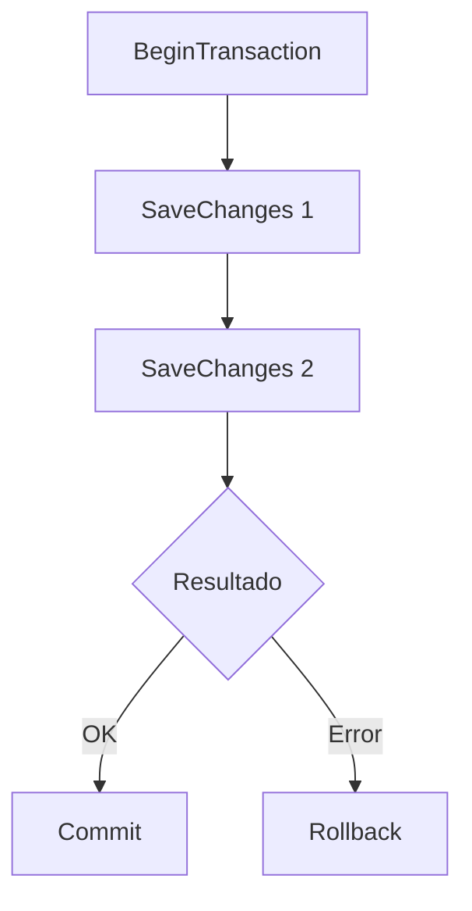

# Lab06e — EF Core: transacciones

## Objetivo y ejecución

Entender la **atomicidad**: las modificaciones de una unidad de trabajo se confirman todas o ninguna. Conservamos Controller → Service → AppDbContext → EF Core → SQLite, async/await y el cliente simple de Lab06c/Lab06d. Una reserva tiene movimientos (`MovimientoReserva`: Id, ReservaId, Descripcion), relacionados por FK y navegaciones.

```powershell
cd Lab06e-EFCore-Transacciones
dotnet run
```

Puerto **5092**. El arranque aplica la migration inicial incluida y agrega un cliente con Id 1. La base propia `Data/reservas.db` está excluida de Git y comienza sin reservas. No modifica las bases de los otros laboratorios. Los POST no requieren body: usan ese cliente y datos fijos para concentrarnos en las transacciones.

## Un SaveChanges: atomicidad implícita

`SaveChangesUnicoAsync` agrega una Reserva y un Movimiento y llama **una sola vez** a `SaveChangesAsync`, sin `BeginTransaction` manual. EF guarda la relación y los Ids generados.

Si el proveedor soporta transacciones, los cambios de esa llamada se aplican atómicamente: si falla una modificación, no se confirma parcialmente ese guardado. SQLite soporta transacciones. Con varias modificaciones como estas, EF inicia y confirma la transacción necesaria; un solo comando SQL puede aprovechar la transacción implícita del motor sin un BEGIN adicional de EF. No estamos cambiando el comportamiento automático por defecto.

```text
SaveChangesAsync
 ↓
varias modificaciones en una transacción
 ↓
todo OK → commit
error   → rollback
```

El logging muestra los INSERT y eventos de transacción. Que el framework abra una transacción para esa llamada no significa que haya una que englobe todo el service.

## Dos SaveChanges separados: el primer cambio permanece

**Un método Service, una request o un DbContext compartido NO convierten automáticamente dos SaveChanges en una sola transacción.**

`DosSaveChangesSinTransaccionAsync` guarda la Reserva y luego provoca una excepción. El Movimiento y `SaveChanges #2` no se alcanzan. Al devolver el primer `SaveChangesAsync`, ese INSERT ya quedó confirmado; el HTTP 500 posterior no lo deshace.

```text
Sin transacción explícita:

SaveChanges #1
    ↓
COMMIT
    ↓
ERROR
    ↓
primer cambio permanece
```

El service contiene el segundo guardado para mostrar la intención; `ProvocarError()` lanza siempre antes de llegar a él. El GET posterior muestra una Reserva con `movimientos: []`.

## Transacción explícita: dos guardados, una decisión final

`ConTransaccionAsync` sirve para los casos exitoso y fallido:

```csharp
await using var transaction = await _db.Database.BeginTransactionAsync();
try
{
    // Reserva + SaveChanges #1.
    // Movimiento + SaveChanges #2, si no provocamos el error.
    await transaction.CommitAsync();
}
catch
{
    await transaction.RollbackAsync();
    throw;
}
```

`BeginTransactionAsync` abre la frontera transaccional; ambos guardados participan en ella. Guardar no confirma todavía la transacción externa. `CommitAsync` confirma sus modificaciones. `RollbackAsync` revierte las de esa transacción; `throw;` propaga la excepción hacia el handler global sencillo de Lab07b, que devuelve 500. El `await using` libera el recurso. El catch del service está en la frontera transaccional para hacer rollback, no en cada controller para inventar respuestas HTTP.



El diagrama resume las salidas. Nuestro error deliberado ocurre **después de SaveChanges #1 y antes del #2**, por lo que salta directamente al rollback:

```text
Con transacción explícita:

BEGIN
    ↓
SaveChanges #1
    ↓
ERROR
    ↓
ROLLBACK
    ↓
ningún cambio de esta operación permanece
```

El caso exitoso sigue BEGIN → Reserva → SaveChanges #1 → Movimiento → SaveChanges #2 → Commit. Solo después del commit devuelve 200.

## Rollback de SQLite vs Change Tracker

Después del primer `SaveChangesAsync`, la Reserva tiene Id generado y estado `Unchanged`: el guardado aceptó los cambios en memoria aunque la transacción externa siga abierta. Después del rollback, en este ejemplo se observa:

```text
>>> Después de Rollback: ReservaId=4, State=Unchanged
```

El Id puede ser otro. **La fila ya no existe en SQLite, pero el objeto y su estado no se restauraron mágicamente.** Un Id asignado o `Unchanged` no prueban que hubo commit. Este es el contraste con `Added`/`Unchanged` de Lab06c: el tracker y la transacción representan estados distintos.

No continuamos usando ese contexto como si la operación hubiera salido bien. Ante una unidad de trabajo fallida, normalmente conviene abandonar su scope/DbContext y finalizar la request. `AddDbContext` registra el contexto como Scoped por defecto; el GET siguiente usa otra instancia, `AsNoTracking`, `Include(Movimientos)` y un SELECT real. Esa request verifica el estado físico de SQLite, sin consultar exclusivamente el objeto que conserva el tracker anterior.

## Transacción y operación de negocio

Una operación como `ReservaService.ReservarAsync()` puede necesitar crear una Reserva, registrar un Movimiento y actualizar otro estado de forma atómica. La transacción representa esa unidad técnica; no se deduce de tener un método Service.

Si todo se guarda con un único `SaveChangesAsync`, normalmente su atomicidad es suficiente. Una transacción explícita tiene sentido cuando necesitamos una frontera que abarque varios guardados u operaciones de BD. No agregamos `BeginTransactionAsync` a todo método por ceremonia.

## Qué NO resuelve este laboratorio

**Atomicidad no es una solución automática de concurrencia.** Dos requests podrían decidir a partir del mismo estado:

```text
Queda un solo cupo.

Request A                 Request B
    |                         |
    | lee cupo = 1            | lee cupo = 1
    |                         |
    | crea reserva            | crea reserva
    |                         |
    v                         v
             SOBREVENTA
```

Es un ejemplo conceptual: dependiendo del acceso y aislamiento, ambas operaciones podrían tener transacciones propias y aun así existir un problema de concurrencia. No afirmamos que SQLite ejecutará exactamente ese intercalado ni simulamos requests concurrentes aquí. La regla de cupos compartidos pertenece al siguiente tema: concurrencia. Una transacción de BD tampoco revierte automáticamente objetos .NET, correos enviados u otros efectos externos.

## Escenarios y mensajes

Las cifras son **incrementos respecto del GET anterior**, para poder repetir los ejemplos sin limpiar la base:

| POST bajo `/api/transacciones/` | HTTP | Cambio persistido | Mensajes principales |
| --- | --- | --- | --- |
| `savechanges-unico` | 200 | +1 Reserva, +1 Movimiento | SaveChanges único → Guardado; EF muestra la transacción automática |
| `dos-savechanges-sin-transaccion` | 500 | +1 Reserva, 0 Movimientos | SaveChanges #1 → Primer cambio confirmado → ERROR; no #2 |
| `transaccion-ok` | 200 | +1 Reserva, +1 Movimiento | BeginTransaction → SaveChanges #1 → #2 → Commit → Confirmado |
| `transaccion-error` | 500 | 0 Reservas, 0 Movimientos | BeginTransaction → SaveChanges #1 → ERROR → Rollback → State=Unchanged; no #2 ni Commit |

Los errores usan ProblemDetails con un mensaje controlado; el detalle técnico queda en los logs. La presencia de 500 no permite inferir por sí sola qué quedó confirmado: comparar los GET.

## Probar y verificar SQLite después de cada escenario

En otra terminal PowerShell, `curl -i` muestra status y JSON. Todos los GET esperan **200**:

```powershell
# Estado inicial: [] en una base nueva.
curl.exe -sS -i http://localhost:5092/api/transacciones/reservas

# A: 200; consola SaveChanges único + Guardado.
curl.exe -sS -i -X POST http://localhost:5092/api/transacciones/savechanges-unico
# GET: una Reserva con un Movimiento, en base nueva.
curl.exe -sS -i http://localhost:5092/api/transacciones/reservas

# B: 500; consola SaveChanges #1 + ERROR; nunca #2.
curl.exe -sS -i -X POST http://localhost:5092/api/transacciones/dos-savechanges-sin-transaccion
# GET: dos Reservas; la nueva tiene movimientos: [].
curl.exe -sS -i http://localhost:5092/api/transacciones/reservas

# C: 200; consola BeginTransaction + #1 + #2 + Commit.
curl.exe -sS -i -X POST http://localhost:5092/api/transacciones/transaccion-ok
# GET: tres Reservas; dos Movimientos en total.
curl.exe -sS -i http://localhost:5092/api/transacciones/reservas

# D: 500; consola BeginTransaction + #1 + ERROR + Rollback + State=Unchanged.
curl.exe -sS -i -X POST http://localhost:5092/api/transacciones/transaccion-error
# GET: siguen las tres Reservas y dos Movimientos; el Id del rollback no aparece.
curl.exe -sS -i http://localhost:5092/api/transacciones/reservas
```

Los resultados se guardan entre ejecuciones: repetir A, B o C agrega filas; D no agrega ninguna. Cada GET es una request independiente y ejecuta SQL con un contexto nuevo. No usamos `Find` sobre el objeto anterior para demostrar el rollback.

Mirar `Services/ReservaService.cs`, `Controllers/TransaccionesController.cs`, `Models/`, `Data/AppDbContext.cs` y `Program.cs`. El logging SQL está en Information y el de eventos de transacción en Debug, sin librerías adicionales. La migration inicial está versionada; la herramienta local se restaura con `dotnet tool restore`, como en Lab06c. Detener con `Ctrl+C`.

## Documentación oficial de Microsoft

- [Transacciones y comportamiento automático de SaveChanges](https://learn.microsoft.com/en-us/ef/core/saving/transactions)
- [SaveChangesAsync y aceptación de cambios](https://learn.microsoft.com/en-us/dotnet/api/microsoft.entityframeworkcore.dbcontext.savechangesasync?view=efcore-10.0)
- [IDbContextTransaction: CommitAsync y RollbackAsync](https://learn.microsoft.com/en-us/dotnet/api/microsoft.entityframeworkcore.storage.idbcontexttransaction?view=efcore-10.0)
- [Lifetime de DbContext y unidad de trabajo](https://learn.microsoft.com/en-us/ef/core/dbcontext-configuration/)
- [Change Tracking](https://learn.microsoft.com/en-us/ef/core/change-tracking/)
- [Logging sencillo de EF Core](https://learn.microsoft.com/en-us/ef/core/logging-events-diagnostics/simple-logging)
