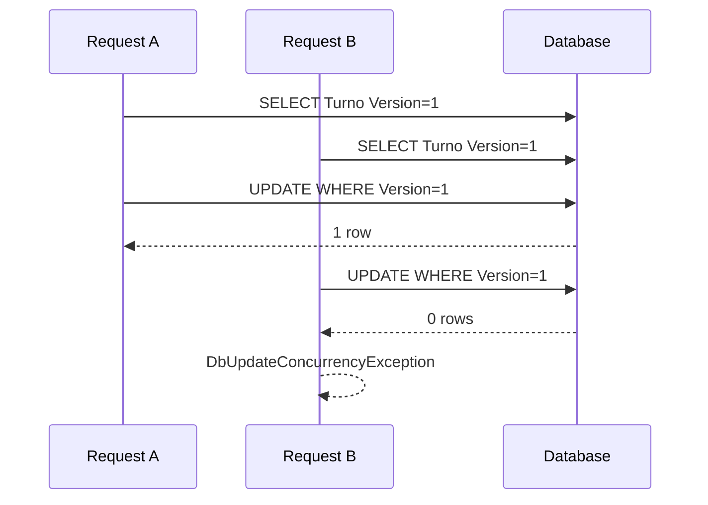

# Lab06f — EF Core: concurrencia

## Objetivo

Continuar Lab06e comprobando que **transacción != control de concurrencia**. Dos requests intentan tomar el último cupo de un `Turno`. Primero observamos la carrera; después detectamos el conflicto con EF Core, SQLite y un token `Version` administrado por la aplicación.

Arquitectura: HTTP → Controller → Service → DbContext → EF Core → SQLite. Cada request usa su propio contexto Scoped. No hay Repository ni una transacción manual que englobe la lectura y la espera.

## Primero: la carrera y el lost update

Concurrencia significa que las operaciones pueden solaparse. Un **race condition** ocurre cuando el resultado depende de cómo se intercalan sus pasos. El turno inicial tiene `Capacidad=1`, `CuposOcupados=0`, `Version=1`.

```text
Request A                         Request B
lee CuposOcupados=0                lee CuposOcupados=0
decide que hay cupo                decide que hay cupo
espera 2 segundos                 espera 2 segundos
incrementa su copia a 1            incrementa su copia a 1
guarda 1                          guarda 1
```

Sin control, ambos pueden recibir 200 y creer que reservaron. El contador final puede ser **1**, aunque se aceptaron **dos** operaciones: la segunda escritura reemplazó el valor sin reflejar la primera. Esto es **lost update**; mirar únicamente el contador ocultaría el problema. Aquí reservamos incrementando un contador; no creamos entidades Reserva adicionales.

`Task.Delay(2000)` sólo amplía la ventana de carrera para observarla. Los logs identifican A/B y muestran lo leído antes de guardar. No sincroniza ni resuelve el problema.

## Transacción vs optimistic concurrency

| Mecanismo | Responsabilidad |
| --- | --- |
| Transacción | Atomicidad de una unidad de trabajo: sus cambios se confirman o se revierten juntos. |
| Optimistic concurrency | Detectar que el dato cambió desde que se leyó, antes de aceptar una escritura basada en ese estado. |

En Lab06e aprendimos la atomicidad de `SaveChangesAsync()`. Eso no detecta por sí solo una decisión tomada sobre datos viejos. Dos transacciones independientes pueden hacer sus propias lecturas, decisiones, updates y commits; el resultado también depende del acceso y aislamiento. Aquí no estudiamos niveles de aislamiento. Ver [transacciones en EF Core](https://learn.microsoft.com/en-us/ef/core/saving/transactions).

## Version y el SQL

En `AppDbContext`, `.IsConcurrencyToken()` marca `Version` como token. Al leer el turno EF conserva su valor original en el Change Tracker. El service incrementa `CuposOcupados` y `Version` antes de guardar.

```sql
-- Sin control: la segunda escritura también puede ser aceptada.
UPDATE Turnos SET CuposOcupados = @nuevo, Version = @nuevaVersion
WHERE Id = @id;

-- Con control: sólo acepta la versión que esta operación leyó.
UPDATE Turnos SET CuposOcupados = @nuevo, Version = @nuevaVersion
WHERE Id = @id AND Version = @versionOriginal;
```

Si ambos leen 1, el primero guarda 2. El segundo busca todavía `Version=1`: modifica **cero filas** y EF lanza `DbUpdateConcurrencyException`. La consola muestra la versión original, la nueva, el SQL real y el conflicto. SQLite agrega `RETURNING 1` a estos updates para que EF compruebe el resultado.



A representa al ganador del ejemplo; en una ejecución real puede ganar B. [Documentación de optimistic concurrency](https://learn.microsoft.com/en-us/ef/core/saving/concurrency).

## Por qué dos contextos pequeños

Ambos contextos mapean el mismo `Turno` a **la misma tabla y base**. `SinControlDbContext` mapea `Version` como una columna normal; `AppDbContext` la configura como concurrency token. Ambos incrementan la versión, pero sólo el segundo la compara al guardar. Así el endpoint vulnerable sigue siendo vulnerable aunque el modelo ya incluya la columna.

Este doble mapping es exclusivamente didáctico: una aplicación real debe proteger todos los escritores del dato y renovar el token en cada modificación relevante. El contexto principal administra las migrations; el contexto sin control sólo demuestra qué sucede al omitir la comprobación.

## SQLite y SQL Server

Usamos un `int Version` incrementado explícitamente. SQLite no tiene el `rowversion` automático de SQL Server; copiar `[Timestamp] byte[] RowVersion` no hace que SQLite lo genere y actualice. El atributo tampoco representa una fecha/hora en ese uso. Ver [limitaciones del provider SQLite](https://learn.microsoft.com/en-us/ef/core/providers/sqlite/limitations).

## Responder al conflicto

El Controller captura únicamente `DbUpdateConcurrencyException` y devuelve **409 Conflict**, `application/problem+json`, con el título «Otro request modificó el turno». No informa éxito: el último cupo pudo haber sido tomado por otra operación.

Si una request llega cuando el turno ya está completo, también devuelve 409, pero con «No hay cupos disponibles». Eso no demuestra una carrera: para observar el token necesitamos que **ambas hayan leído 0 y Version 1** antes del primer guardado.

Otras estrategias posibles son recargar, reintentar o combinar cambios. No se implementan aquí: reintentar una reserva exige volver a comprobar disponibilidad. Después del conflicto finaliza la request y se descarta su contexto; sus valores en memoria no prueban el estado de SQLite. El GET posterior usa un scope nuevo y `AsNoTracking()`.

Un error del provider, por ejemplo un problema de locking, no se disfraza de conflicto optimista: el fallback global devuelve 500. Los resultados físicos de SQLite deben observarse, no presuponerse.

## Migrations y ejecución

```powershell
cd Lab06f-EFCore-Concurrencia
dotnet tool restore
dotnet build
dotnet ef database update --context AppDbContext
dotnet run
```

URL: `http://localhost:5093`. Base local: `Data/turnos.db`, ignorada por Git. El arranque aplica las migrations pendientes y crea el turno 1 si la tabla está vacía; no usa `EnsureCreated`.

Las migrations incluidas se generaron en dos pasos:

```powershell
# Con el modelo inicial sin Version:
dotnet ef migrations add InitialCreate --context AppDbContext
# Después de agregar Version y configurarla como token:
dotnet ef migrations add AgregarVersionConcurrencia --context AppDbContext
dotnet ef database update --context AppDbContext
```

No repetir `migrations add` al clonar: ya están versionadas. La segunda agrega `Version` con default 1 para filas existentes; el snapshot registra el token. El `WHERE` protegido lo genera EF a partir del mapping, no un trigger de SQLite. `--context` es necesario porque existen dos contextos. Ver [migrations](https://learn.microsoft.com/en-us/ef/core/managing-schemas/migrations/).

## Experimentos en otra consola de Windows PowerShell

Desde la carpeta del laboratorio, con la API ejecutándose:

```powershell
$base = 'http://localhost:5093/api/concurrencia'

# 1. Reset: 200. Capacidad=1, CuposOcupados=0, Version=1.
curl.exe -i -X POST "$base/reset/1"
# 2. Consultar estado físico desde una request nueva: 200.
curl.exe -i "$base/turnos/1"

# 3. Dos requests vulnerables: observar sus HTTP y cuerpos reales.
powershell.exe -NoProfile -ExecutionPolicy Bypass -Command '& ".\scripts\dos-requests.ps1" -Modo sin-control | Format-List Operacion, HTTP, Cuerpo'
# 4. Consultar resultado físico; contrastarlo con ambos resultados HTTP.
curl.exe -i "$base/turnos/1"

# 5. Esperar a que terminen ambos jobs antes de resetear.
curl.exe -i -X POST "$base/reset/1"
curl.exe -i "$base/turnos/1"

# 6. Dos requests con token: si ambas leen Version=1, esperamos 200 y 409.
powershell.exe -NoProfile -ExecutionPolicy Bypass -Command '& ".\scripts\dos-requests.ps1" -Modo con-control | Format-List Operacion, HTTP, Cuerpo'
# 7. Estado final esperado: CuposOcupados=1, Version=2.
curl.exe -i "$base/turnos/1"
```

El script inicia dos `Start-Job`, les da una hora UTC común de salida y usa `curl.exe` sin tratar HTTP 409 como un fallo de transporte. Imprime lo que realmente respondió cada request; no fabrica resultados ni reintenta. El tiempo de preparación es de ocho segundos, más los dos segundos del delay.

Los comandos usan `Bypass` exclusivamente en el proceso que ejecuta este script local, para permitirlo si la política exige firma. No cambian la política del equipo. Si tu política permite scripts locales, basta con `.\scripts\dos-requests.ps1 -Modo con-control`. Ver [políticas de ejecución de PowerShell](https://learn.microsoft.com/en-us/powershell/module/microsoft.powershell.core/about/about_execution_policies).

En consola deben aparecer **dos lecturas de CuposOcupados=0, Version=1 antes del primer SaveChanges**. Sin control buscamos dos éxitos; con control, un éxito y `DbUpdateConcurrencyException: 0 filas actualizadas ... HTTP 409`. Si no se solaparon, resetear una vez terminados los jobs y repetir. SQLite puede serializar escrituras o producir errores de locking según el escenario; revisar HTTP, logs y GET conjuntamente.

El reset es sólo una ayuda de laboratorio, con cero operaciones en vuelo. Volver una versión a 1 en producción podría hacer válida una lectura antigua; no es una estrategia de versionado real.

## Resultado observado al verificar

Ejecutado el 5 de octubre de 2026 en Windows PowerShell, SDK .NET `10.0.401` y EF Core/SQLite provider `10.0.12`, con las dos migrations aplicadas:

| Escenario | Request A | Request B | GET posterior: CuposOcupados / Version |
| --- | --- | --- | --- |
| Sin control | 200, reservado=true | 200, reservado=true | 1 / 2 |
| Con control | 409, conflicto optimista | 200, reservado=true | 1 / 2 |

En ambos experimentos los logs mostraron las dos lecturas de `0 / 1` antes de guardar. Sin control, SQLite aceptó ambos updates con `WHERE Id`; no hubo error de locking. Con control, B guardó primero y A recibió `DbUpdateConcurrencyException` por cero filas con la versión original 1. Su respuesta fue `application/problem+json`, con `status=409` e `instance=/api/concurrencia/reservar-con-control/1`. Los GET se ejecutaron después de terminar ambos jobs, en requests independientes. Este registro describe esa ejecución; el ganador y los tiempos no están garantizados.

## Archivos para leer

- `Models/Turno.cs`: contador y versión.
- `Data/AppDbContext.cs` y `Data/SinControlDbContext.cs`: diferencia del mapping.
- `Services/TurnoService.cs`: lectura, comprobación, delay, incremento y SaveChanges.
- `Controllers/ConcurrenciaController.cs`: éxito, falta de cupo y conflicto 409.
- `Program.cs` y `Migrations/`: DI, SQL logging, base y evolución del esquema.
- `scripts/dos-requests.ps1`: dos requests simultáneos; `docs/concurrencia.mmd`: diagrama.
