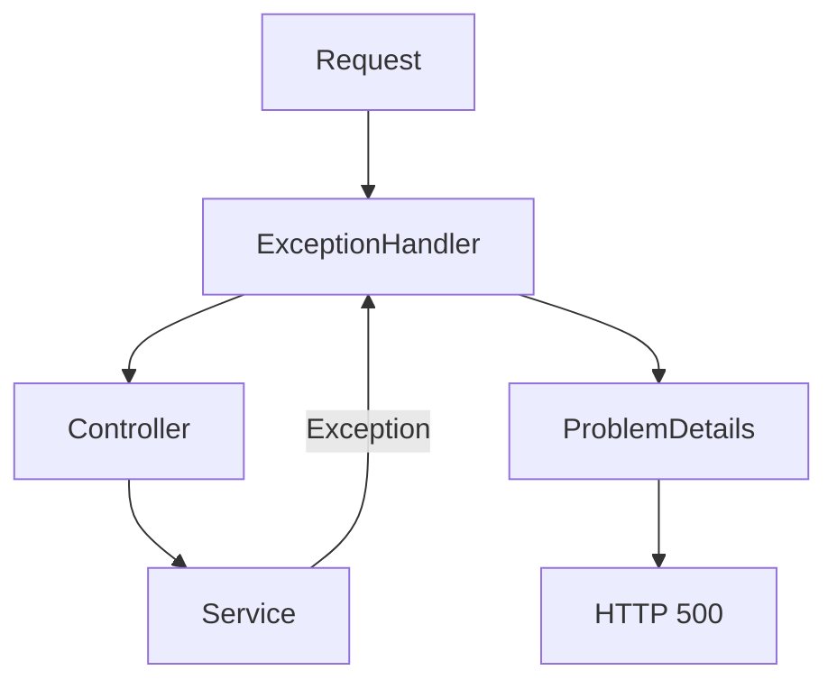

# Lab07b — Excepciones globales y ProblemDetails

## Objetivo

Responder a una excepción no controlada con **500 + ProblemDetails** en .NET 10. `PruebaController` llama a `IPruebaService`; `PruebaService` lanza deliberadamente una `InvalidOperationException`. La captura se concentra en el pipeline HTTP.

## Parte 1: sin handler global

La excepción sale del service, interrumpe la Action y vuelve por los componentes anteriores del pipeline. Repetir `try/catch (Exception ex)` en cada controller duplicaría el tratamiento y podría producir respuestas inconsistentes.

Sin `UseExceptionHandler`, en Development `WebApplication.CreateBuilder` habilita la Developer Exception Page, que puede mostrar detalles técnicos. Fuera de Development, si la excepción llega al servidor antes de enviar headers, este devuelve 500 sin body; no tenemos un contrato JSON de error. Si la respuesta ya comenzó, no se puede sustituir por ProblemDetails.

Controller y Service no contienen `try/catch`. La parte 1 se explica aquí; el código ejecutable ya incluye el handler global.

## Parte 2: handler global

Mirar `Program.cs`:

- `AddProblemDetails()` registra en DI los servicios que producen y escriben ProblemDetails. Por sí solo no captura excepciones.
- `UseExceptionHandler()` agrega el middleware que captura excepciones de componentes posteriores y genera la respuesta 500 usando esos servicios.
- `CustomizeProblemDetails` ajusta `title`, `detail` e `instance` al preparar el JSON; no es quien captura la excepción. El framework aporta `status`, `type` y puede agregar `traceId`.

Se usa el middleware oficial directamente, sin clase `IExceptionHandler` adicional. Está activo también en Development para que los endpoints del laboratorio devuelvan el mismo error controlado.

## ProblemDetails

Es el formato estándar **Problem Details for HTTP APIs**: evita inventar una estructura JSON distinta por API. En este laboratorio:

| Campo | Significado | Valor observado |
| --- | --- | --- |
| `status` | Código HTTP del problema | `500` |
| `title` | Resumen del tipo de problema | `Se produjo un error inesperado.` |
| `detail` | Explicación de esta ocurrencia | Mensaje controlado del laboratorio |
| `type` | URI que identifica el tipo de problema | Referencia estándar del framework para HTTP 500 |
| `instance` | Identifica esta ocurrencia; aquí se usa el path solicitado | `/api/prueba-error` |

La respuesta usa `Content-Type: application/problem+json`. El Id de trazabilidad, si aparece, es una extensión del formato, no un stack trace.

## Pipeline y orden



El handler debe estar antes de los componentes que pueden fallar. El middleware didáctico va **antes del handler**, envolviéndolo: cuando `await next()` retorna, el error ya se transformó en una respuesta. Las líneas didácticas aparecen en este orden, intercaladas con logs del framework:

```text
[Middleware antes] GET /api/prueba-error
[Controller] GET /api/prueba-error
[Service] ProvocarError
[Exception] Se lanza InvalidOperationException
[Exception Handler] Preparando ProblemDetails
HTTP 500
[Middleware después]
```

Si el middleware didáctico estuviera dentro del handler, la excepción interrumpiría su `await next()` y su código posterior no se ejecutaría. No agregamos otro `try/catch` para observar el retorno.

## Lab07a vs Lab07b

**Lab07a: error de entrada.**

```text
Request inválido
 ↓
Model Binding / Validation
 ↓
ModelState inválido
 ↓
[ApiController]
 ↓
HTTP 400
Controller NO se ejecuta
```

**Lab07b: excepción durante el procesamiento.**

```text
Request válido
 ↓
Controller
 ↓
Service
 ↓
Exception
 ↓
Exception Handler global
 ↓
ProblemDetails
 ↓
HTTP 500
```

El 400 automático de Lab07a nace del ModelState inválido y usa `ValidationProblemDetails` con `errors`. Aquí la entrada permite ejecutar la Action; falla el procesamiento y el middleware genera un ProblemDetails de 500. `[ApiController]` no captura por sí mismo las excepciones del service.

## Información que no debe exponerse

En producción normalmente no se devuelve stack trace, nombres internos de clases, paths del servidor ni información sensible de la excepción. El detalle técnico queda en logging; el middleware oficial registra esta excepción con el logging integrado. El JSON usa un mensaje fijo: no copia `exception.Message` ni `exception.ToString()`.

## Cómo ejecutar y probar

Desde la raíz:

```powershell
cd Lab07b-Errores-ProblemDetails
dotnet run
```

En otra terminal PowerShell:

```powershell
# HTTP 200, application/json y {"mensaje":"Todo funciona."}.
curl.exe -sS -i http://localhost:5090/api/prueba-ok

# HTTP 500, application/problem+json y los campos de ProblemDetails.
curl.exe -sS -i http://localhost:5090/api/prueba-error

# HTTP 200 nuevamente: una excepción de esta request no detiene la API.
curl.exe -sS -i http://localhost:5090/api/prueba-ok
```

Comparar headers, JSON y consola. La request normal imprime `HTTP 200` y no prepara ProblemDetails. Los dos endpoints son GET y no necesitan body. Detener con `Ctrl+C`.

Archivos clave: `Program.cs`, `Controllers/PruebaController.cs`, `Services/IPruebaService.cs` y `Services/PruebaService.cs`. El diagrama también está en `docs/errores.mmd`.

## Documentación oficial de Microsoft

- [Manejo de errores, Developer Exception Page y Exception Handler](https://learn.microsoft.com/en-us/aspnet/core/fundamentals/error-handling?view=aspnetcore-10.0)
- [Errores y ProblemDetails en APIs](https://learn.microsoft.com/en-us/aspnet/core/fundamentals/error-handling-api?view=aspnetcore-10.0)
- [AddProblemDetails](https://learn.microsoft.com/en-us/dotnet/api/microsoft.extensions.dependencyinjection.problemdetailsservicecollectionextensions.addproblemdetails?view=aspnetcore-10.0)
- [Campos de ProblemDetails](https://learn.microsoft.com/en-us/dotnet/api/microsoft.aspnetcore.mvc.problemdetails?view=aspnetcore-10.0)
