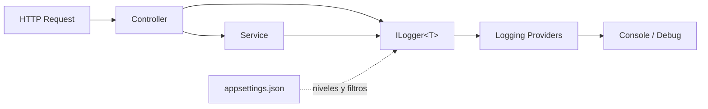

# Lab08 — Logging integrado

## Objetivo

Observar logging de ASP.NET Core/.NET 10 en Controller → Service, con una reserva fija en memoria. Sin persistencia ni paquetes externos. El service es síncrono porque no realiza I/O; el handler usa el contrato async del framework para escribir la respuesta.

## ILogger<T>, categorías y providers

DI entrega `ILogger<ReservasController>` y `ILogger<ReservaService>` sin un registro propio. `T` determina la categoría por su nombre completo: `Lab08.Controllers.ReservasController` y `Lab08.Services.ReservaService`. Identifica el origen del evento y permite filtrarlo; no es su severidad.

`ILogger` es la abstracción de la aplicación. Los **providers** envían los eventos habilitados a sus destinos. `WebApplication.CreateBuilder` configura los estándar: Console, Debug, EventSource y, en Windows, EventLog. Conservamos esos defaults. Console se observa en la terminal; Debug en la salida del depurador cuando hay uno conectado. Los experimentos miran Console; EventLog tiene su propio mínimo Warning por defecto y no hereda las reglas generales sin configuración específica. No configuramos archivos ni librerías externas.



El diagrama resume Console/Debug; también está en `docs/logging.mmd`.

## Niveles y filtros

| Nivel | Uso conceptual |
| --- | --- |
| Trace | Detalle muy fino del recorrido |
| Debug | Diagnóstico durante desarrollo |
| Information | Operación normal relevante |
| Warning | Situación inesperada que permite continuar |
| Error | Fallo de una operación |
| Critical | Fallo grave que compromete el funcionamiento |

Orden: **Trace < Debug < Information < Warning < Error < Critical**. Un mínimo Information filtra Trace/Debug. `None` deshabilita la categoría. `/niveles` emite seis **muestras didácticas**: sus Error/Critical no representan fallos reales y no cambian su HTTP 200.

`appsettings.json` contiene:

```json
"Logging": {
  "LogLevel": {
    "Default": "Information",
    "Microsoft.AspNetCore": "Warning",
    "Lab08.Services": "Information"
  },
  "Console": {
    "FormatterName": "simple",
    "FormatterOptions": { "IncludeScopes": true, "SingleLine": true }
  }
}
```

- `Default`: mínimo cuando no hay una regla de categoría más específica.
- `Microsoft.AspNetCore`: reduce el ruido habitual del framework; mantiene Warning y superiores.
- `Lab08.Services`: regla para ese prefijo, incluida `Lab08.Services.ReservaService`. Cambiarla no cambia el mínimo del Controller ni del handler.
- Console configura el formato y hace visibles los scopes. No agregamos filtros propios de un provider; éstos podrían prevalecer sobre las reglas generales.

Entre categorías aplicables se elige la más específica. No hay `appsettings.Development.json` ni filtros en C# que oculten los experimentos. Reiniciar tras editar el JSON hace reproducible la comparación, aunque la configuración admite recarga.

## Logging estructurado

```csharp
// Concatena y pierde la propiedad independiente.
logger.LogInformation("Procesando reserva " + id);

// Conserva plantilla y valor como información del evento.
logger.LogInformation("Procesando reserva {ReservaId}", id);
```

El código utiliza la segunda forma, también con `{Estado}`. `{ReservaId}` es el nombre de una propiedad estructurada, no `String.Format` ni una búsqueda de la variable C# por nombre. Los argumentos se asocian por orden. El provider decide cómo representar los datos: Simple Console muestra texto, aunque el evento conserva plantilla y valores. Evitamos interpolación y concatenación en los logs ejecutables.

## Scopes

Cada Action abre:

```csharp
using var scope = _logger.BeginScope("Procesando ReservaId={ReservaId}", id);
```

Agrega contexto común a los logs de la operación, incluso los del Service con otra categoría. Console muestra `=> Procesando ReservaId=1` junto a los eventos. El `using` delimita su duración; no modifica nivel ni categoría. Se libera también al propagarse una excepción: el handler registra ReservaId explícitamente porque el scope de la Action ya terminó. No implementamos tracing distribuido.

## Excepciones y respuesta HTTP

`ProvocarError` lanza `InvalidOperationException`. Controller y Service no la capturan. `UseExceptionHandler` la recibe y llama al único `ReservaExceptionHandler`, que registra:

```csharp
_logger.LogError(exception, "Error procesando reserva {ReservaId}", id);
```

La excepción es un argumento independiente: el provider puede mostrar tipo, mensaje y stack trace en el servidor. **Respuesta HTTP al cliente != detalle técnico del log.** El JSON 500 sólo usa un mensaje fijo: no copia `exception.Message`, nombres internos ni stack traces.

El handler implementa `IExceptionHandler` y se registra en DI con `AddExceptionHandler`. `TryHandleAsync` devuelve `true` cuando el writer de ProblemDetails pudo escribir la respuesta; `false` permite continuar el tratamiento del middleware. CancellationToken pertenece a ese contrato oficial, sin introducir aquí un experimento de cancelación.

En .NET 10, un `IExceptionHandler` que devuelve true suprime por defecto los diagnósticos automáticos de esa excepción en el middleware. Nuestro LogError explícito deja visible el fallo sin registrarlo en cada capa. No agregamos mappings de excepciones de negocio.

## Ejecutar

Desde una consola en la raíz:

```powershell
cd Lab08-Logging
dotnet restore
dotnet build
dotnet run
```

Puerto **5094**, sin preparación de infraestructura. Detener con `Ctrl+C`. Editar el JSON desde el IDE y reiniciar para los experimentos siguientes.

## Experimentos en otra consola PowerShell

```powershell
$base = 'http://localhost:5094/api/reservas'

# 1. Normal: 200; Information en Controller y Service, sin Debug/Trace del Service.
curl.exe -sS -i "$base/1"

# 2. Cambiar Logging:LogLevel:Lab08.Services de Information a Debug y reiniciar.
# 200; aparece "Buscando reserva 1 en memoria"; Trace sigue filtrado.
curl.exe -sS -i "$base/1"

# 3. Warning: 404; Service registra "Reserva 999 no encontrada".
curl.exe -sS -i "$base/999"

# 4. Excepción: 500 + application/problem+json; LogError técnico en servidor.
curl.exe -sS -i "$base/1/prueba-error"
# La API sigue disponible: 200.
curl.exe -sS -i "$base/1"

# 5. En Controller Y Service buscar "Procesando ReservaId=1" junto a sus mensajes.
curl.exe -sS -i "$base/1"

# 6. Muestras de todos los niveles: siempre HTTP 200.
curl.exe -sS -i "$base/1/niveles"
```

Para el experimento 6, cambiar **sólo** `Lab08.Services` y reiniciar entre llamadas:

| Mínimo del Service | Muestras visibles |
| --- | --- |
| Information | Information, Warning, Error, Critical |
| Debug | Las anteriores + Debug |
| Trace | Las seis |
| Warning | Warning, Error, Critical |

Con Warning, Information del Controller **sigue apareciendo**: es otra categoría. Para aislar el scope, cambiar `IncludeScopes` a false y comparar: desaparece ese contexto, pero se conservan los mensajes y sus propiedades. Al terminar, restaurar **Information** e **IncludeScopes=true**.

## Comparación con Java/Spring

`ILogger<T>` cumple el papel de una facade consumida por la aplicación; recuerda al logger asociado a una clase mediante SLF4J. Los niveles/categorías en appsettings cumplen una función comparable a la configuración de logging de Spring Boot. `BeginScope` aporta contexto de operación, una idea cercana al contexto diagnóstico, sin equivalencia interna 1:1 con MDC. Los providers de .NET no tienen necesariamente los contratos de los appenders de Logback.

## Archivos para mirar

- `Program.cs`: DI, handler global y defaults de logging.
- `Controllers/ReservasController.cs`: ILogger inyectado y scopes.
- `Services/ReservaService.cs`: templates, niveles y excepción deliberada.
- `Errors/ReservaExceptionHandler.cs`: excepción registrada y JSON controlado.
- `appsettings.json`: filtros y formato Console.
- `Models/Reserva.cs` y `Services/IReservaService.cs`: caso mínimo en memoria.

## Documentación oficial de Microsoft

- [Logging de ASP.NET Core: categorías, filtros y scopes](https://learn.microsoft.com/en-us/aspnet/core/fundamentals/logging/?view=aspnetcore-10.0)
- [Logging en .NET y plantillas estructuradas](https://learn.microsoft.com/en-us/dotnet/core/extensions/logging)
- [Providers integrados](https://learn.microsoft.com/en-us/dotnet/core/extensions/logging/providers)
- [Formatters de Console](https://learn.microsoft.com/en-us/dotnet/core/extensions/console-log-formatter)
- [Manejo de errores e IExceptionHandler en .NET 10](https://learn.microsoft.com/en-us/aspnet/core/fundamentals/error-handling?view=aspnetcore-10.0#iexceptionhandler)
