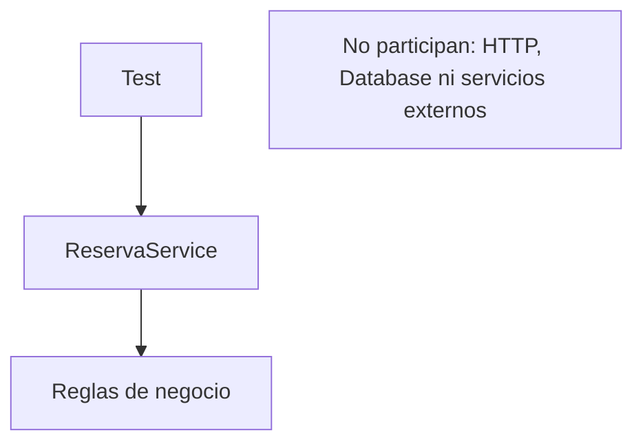

# Lab09a — Unit testing con xUnit

## Objetivo

Probar una regla de reservas de forma rápida y aislada en .NET 10. `PuedeReservar(lugaresDisponibles, cantidadSolicitada)` devuelve `true` cuando hay lugares, la cantidad solicitada es positiva y no supera la disponibilidad. Cero o negativos devuelven `false`; solicitar exactamente todos los lugares es válido. La operación sólo evalúa la regla: no persiste ni consume cupos.

## Estructura

```text
Lab09a-UnitTesting/
├── Lab09a-UnitTesting.slnx
├── src/Lab09a.Reservas/
│   ├── Lab09a.Reservas.csproj
│   └── Services/ReservaService.cs
├── tests/Lab09a.Reservas.Tests/
│   ├── Lab09a.Reservas.Tests.csproj
│   └── ReservaServiceTests.cs
└── docs/unit-testing.mmd
```

`src` contiene el código productivo; `tests` contiene las pruebas y sus dependencias. El `ProjectReference` del proyecto de tests apunta a la biblioteca: se prueba la clase real, sin copiar su implementación. La solución `.slnx` agrupa los dos proyectos para restaurarlos, compilarlos y probarlos desde una sola carpeta.

**xUnit** es el framework que descubre y ejecuta los tests y ofrece atributos y assertions. Aquí usamos xUnit v3; el `.csproj` fija las versiones. `Microsoft.NET.Test.Sdk` y `xunit.runner.visualstudio` permiten ejecutarlos con `dotnet test` mediante el runner VSTest habitual de la CLI. `OutputType=Exe` es parte del modelo de proyectos xUnit v3, no una API HTTP.

## Primer test: Fact y Arrange / Act / Assert

Leer primero `PuedeReservar_CuandoHayCupo_DevuelveTrue`:

```csharp
[Fact]
public void PuedeReservar_CuandoHayCupo_DevuelveTrue()
{
    // Arrange
    var service = new ReservaService();
    int lugaresDisponibles = 2;
    int cantidadSolicitada = 1;

    // Act
    bool resultado = service.PuedeReservar(lugaresDisponibles, cantidadSolicitada);

    // Assert
    Assert.True(resultado);
}
```

**Arrange** prepara objeto y entradas; **Act** ejecuta el comportamiento; **Assert** comprueba su resultado observable. `[Fact]` identifica un caso concreto sin parámetros. Los otros dos Facts comprueban ausencia de cupos y uso de todos los lugares disponibles.

Los nombres describen método/comportamiento, escenario y resultado esperado. Así un fallo se entiende desde el listado de tests, sin depender del orden de ejecución.

## Theory, InlineData y assertions

Después leer la `[Theory]`: una misma prueba parametrizada se ejecuta con diferentes datos. Cada `[InlineData(lugaresDisponibles, cantidadSolicitada, esperado)]` aporta una fila; xUnit reporta cada fila como un caso independiente. Incluye cantidad cero, negativa, superior al cupo y disponibilidad cero o negativa.

| Assertion | Intención |
| --- | --- |
| `Assert.True(resultado)` | El comportamiento debe aceptar la reserva. |
| `Assert.False(resultado)` | El comportamiento debe rechazarla. |
| `Assert.Equal(esperado, resultado)` | El resultado debe coincidir con el esperado de esa fila. |

La suite tiene **3 Facts + 1 Theory con 7 filas = 10 casos ejecutados**. Algunos escenarios de los Facts reaparecen en la Theory para comparar las dos formas de escribir una prueba.

## Qué significa unitario aquí

La unidad bajo prueba es el comportamiento de `ReservaService`. Cada test instancia directamente `new ReservaService()` y proporciona sus entradas. No necesita contenedor de DI ni depende de SQLite, archivos, red, servidor HTTP, reloj real o servicios externos. No comparte estado mutable con otros tests.



El diagrama también está en [unit-testing.mmd](docs/unit-testing.mmd). Una prueba que incluya infraestructura o comunicación entre componentes tendría otro alcance; eso se estudiará en Lab09c.

## Ejecutar

Desde la raíz del repositorio, con el SDK .NET 10:

```powershell
cd Lab09a-UnitTesting
dotnet restore
dotnet build
dotnet test
```

`restore` obtiene los paquetes; `build` compila ambos proyectos; `test` descubre y ejecuta las pruebas. Si todas pasan, muestra 10 casos correctos, 0 fallidos y devuelve código de salida 0. La biblioteca se ejecuta mediante las llamadas de los tests; no hay que levantar una API.

Para ejecutar solamente el primer Fact:

```powershell
dotnet test --filter "FullyQualifiedName~PuedeReservar_CuandoHayCupo_DevuelveTrue"
```

## Experimento: una expectativa equivocada

1. En el primer Fact, cambiar temporalmente `Assert.True(resultado)` por `Assert.False(resultado)`.
2. Ejecutar el comando filtrado anterior. La regla devuelve `true`, pero ahora esperamos `false`: xUnit muestra el nombre del test, la assertion fallida, el valor esperado/real y la ubicación. `dotnet test` termina con código distinto de cero; en PowerShell se puede consultar `$LASTEXITCODE`.
3. Restaurar `Assert.True(resultado)` y ejecutar `dotnet test`: los 10 casos deben volver a pasar.

Cambiar una expectativa no cambia la regla productiva. Un test fallido indica una discrepancia entre comportamiento y expectativa; hay que decidir cuál es incorrecto. El laboratorio se entrega con todas las expectativas correctas.

## Comparación con Java y próximo paso

| .NET / xUnit | Referencia conceptual en Java |
| --- | --- |
| `[Fact]` | JUnit `@Test` |
| `[Theory]` + `[InlineData]` | Tests parametrizados de JUnit |
| `Assert.*` | Assertions de JUnit |
| `dotnet test` | Ejecución de tests mediante Maven/Gradle |

Son equivalencias conceptuales, no APIs idénticas. El aislamiento proviene de las dependencias y del alcance de la prueba, no del framework elegido.

¿Qué ocurre cuando `ReservaService` depende de un repository, gateway o servicio externo? **Lab09b — Mocking / Test Doubles** estudiará cómo controlar esas dependencias. Aquí todavía no hacen falta dobles ni librerías de mocking.

## Documentación oficial

- [Microsoft: buenas prácticas de unit testing](https://learn.microsoft.com/en-us/dotnet/core/testing/unit-testing-best-practices).
- [Microsoft: dotnet test](https://learn.microsoft.com/en-us/dotnet/core/tools/dotnet-test).
- [Microsoft: soluciones y dotnet sln](https://learn.microsoft.com/en-us/dotnet/core/tools/dotnet-sln).
- [xUnit: primeros tests, Fact y Theory](https://xunit.net/docs/getting-started/v3/getting-started).
