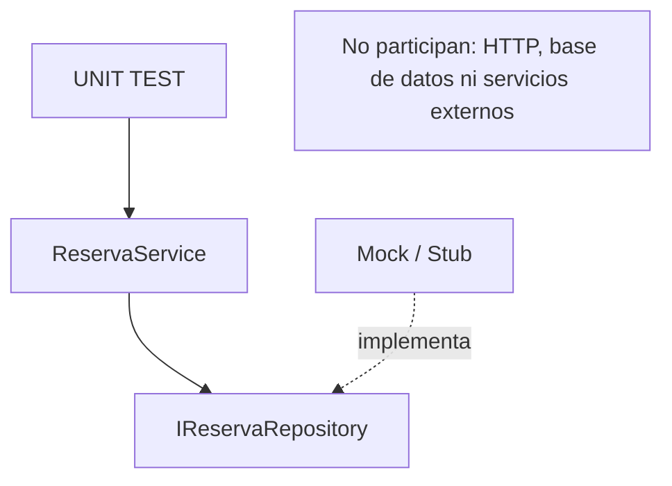

# Lab09b — Mocking y Test Doubles

## Objetivo y evolución desde Lab09a

Probar `ReservaService` de forma aislada cuando necesita una dependencia externa. En Lab09a bastaba `new ReservaService()`: la disponibilidad llegaba como argumento. Aquí `ReservarAsync(turnoId, cantidadSolicitada)` consulta cupos mediante `IReservaRepository`, aplica las mismas reglas y solicita guardar si hay disponibilidad. Devuelve `true` después de completar el guardado o `false` si no puede reservar.

## Estructura y Dependency Injection

```text
Lab09b-Mocking/
├── Lab09b-Mocking.slnx
├── src/Lab09b.Reservas/
│   ├── Lab09b.Reservas.csproj
│   ├── Repositories/IReservaRepository.cs
│   └── Services/ReservaService.cs
├── tests/Lab09b.Reservas.Tests/
│   ├── Lab09b.Reservas.Tests.csproj
│   └── ReservaServiceTests.cs
└── docs/
    ├── 09b.1-Mocks-y-Test-Doubles.md
    ├── mocking.mmd
    └── test-doubles.mmd
```

El contrato expone `Task<int> ObtenerCuposDisponiblesAsync(int turnoId)` y `Task GuardarReservaAsync(int turnoId, int cantidadSolicitada)`. No implementamos un repository real. La biblioteca productiva no tiene paquetes externos; el proyecto de tests referencia esa biblioteca mediante `ProjectReference` y agrega **Moq 4.21.0**, además de xUnit v3.

El constructor recibe `IReservaRepository` desde afuera. DI no existe sólo para facilitar testing: depender del contrato desacopla el service de una implementación concreta. En producción podría recibir un `EfReservaRepository`; en el test recibe `repository.Object`. Esa implementación persistente es solamente conceptual aquí. No hace falta construir un contenedor de DI para inyectar el objeto.

## Test Doubles y Moq

**Test Double** es el término general para sustituir una dependencia real durante una prueba:

```text
Test Double
├── Dummy: completa una llamada; su comportamiento no se utiliza.
├── Stub: proporciona respuestas controladas.
├── Fake: implementación funcional simplificada.
└── Mock: permite verificar interacciones esperadas.
```

Moq genera un objeto que implementa `IReservaRepository`. Aunque la API se llame `Mock<T>`, el papel del objeto depende de cómo lo usamos: puede servir como stub, como mock o cumplir ambos papeles. Se simula la dependencia; **el service bajo prueba es real**.



Fuente del diagrama: [mocking.mmd](docs/mocking.mmd). Cada test crea sus propios objetos; no hay estado compartido, servidor, persistencia ni servicios externos.

## Stub: controlar respuestas

Leer primero `ReservarAsync_CuandoHayCupo_ConfirmaReserva`:

```csharp
// Arrange
var repository = new Mock<IReservaRepository>();
repository.Setup(r => r.ObtenerCuposDisponiblesAsync(1)).ReturnsAsync(2);
repository.Setup(r => r.GuardarReservaAsync(1, 1)).Returns(Task.CompletedTask);
var service = new ReservaService(repository.Object);

// Act
bool confirmado = await service.ReservarAsync(1, 1);

// Assert
Assert.True(confirmado);
```

`Setup` identifica la llamada y los argumentos que queremos configurar; `ReturnsAsync(2)` hace que la consulta responda con un `Task<int>` cuyo resultado es 2. Significa: **cuando el service pregunte los cupos del turno 1, la dependencia responderá 2 durante este test**.

`GuardarReservaAsync` devuelve `Task` sin resultado: `Returns(Task.CompletedTask)` configura una finalización exitosa sin persistir nada. `Returns` establece el objeto devuelto; `ReturnsAsync` facilita devolver un valor dentro de `Task<T>`. Los tasks configurados aquí ya están completados; no simulan I/O ni añaden esperas artificiales.

Arrange crea/configura el doble e inyecta `repository.Object`; Act ejecuta el service real; Assert comprueba el resultado. **Este test usa Moq como stub y no necesita `Verify`.** `Setup` por sí solo no exige que una llamada ocurra.

## Mock: verificar interacciones

Leer después `ReservarAsync_CuandoHayCupo_GuardaUnaVez` y `ReservarAsync_CuandoNoHayCupo_NoGuardaReserva`. Tras ejecutar el service:

```csharp
repository.Verify(r => r.GuardarReservaAsync(turnoId, cantidadSolicitada), Times.Once());

repository.Verify(
    r => r.GuardarReservaAsync(It.IsAny<int>(), It.IsAny<int>()), Times.Never());
```

Son assertions de **dos tests distintos**: con cupo debe guardar exactamente una vez con los argumentos esperados; sin cupo no debe guardar con ningún argumento. `It.IsAny<int>()` es un matcher que acepta cualquier entero.

**Resultado:** `Assert...` pregunta qué produjo el service. **Interacción:** `Verify...` pregunta qué llamada hizo a su dependencia. No todo test con Moq necesita Verify: preferir resultados observables cuando basten. Aquí guardar o no guardar es parte relevante del comportamiento; no verificamos un orden interno de llamadas ni todas las consultas por ceremonia.

## Tests y async

| Test | Qué comprueba |
| --- | --- |
| `ReservarAsync_CuandoHayCupo_ConfirmaReserva` | Resultado `true`, con un stub. |
| `ReservarAsync_CuandoHayCupo_GuardaUnaVez` | `Verify(..., Times.Once())` con argumentos concretos. |
| `ReservarAsync_CuandoNoHayCupo_RechazaReserva` | Resultado `false`, con cero cupos. |
| `ReservarAsync_CuandoNoHayCupo_NoGuardaReserva` | `Verify(..., Times.Never())` para cualquier argumento. |
| `ReservarAsync_CuandoCantidadEsInvalidaParaDosCupos_RechazaReserva` | Theory para cantidades 0, -1 y 3, disponiendo de 2 cupos. |

**4 Facts + 1 Theory con 3 filas = 7 casos ejecutados.** Tanto el service como los tests consumen las operaciones con `await`; los tests retornan `async Task`. xUnit espera ese Task y recoge los fallos. No necesitamos bloquear con `.Result` o `.Wait()` ni usar `async void`.

## Ejecutar

Desde la raíz del repositorio, con SDK .NET 10:

```powershell
cd Lab09b-Mocking
dotnet restore
dotnet build
dotnet test
```

Se esperan 7 casos correctos y 0 fallidos. No hay que levantar una API: el runner llama directamente al código productivo a través de los tests.

## Experimento: resultado correcto, interacción ausente

1. En [ReservaService.cs](src/Lab09b.Reservas/Services/ReservaService.cs), comentar temporalmente `await _repository.GuardarReservaAsync(turnoId, cantidadSolicitada);`, conservando `return true;`.
2. Ejecutar `dotnet test`. El test `ConfirmaReserva` sigue pasando: el booleano continúa siendo `true`. **`GuardaUnaVez` falla**: Moq esperaba una llamada y encontró cero. El resto continúa pasando; `$LASTEXITCODE` es distinto de cero.
3. Descomentar el guardado y ejecutar `dotnet test`: los 7 casos deben volver a pasar.

El experimento muestra por qué comprobar solamente el booleano no alcanza para demostrar que se solicitó guardar. `Verify` tampoco demuestra que una base real persista correctamente: esa implementación no participa en estos unit tests.

## Comparación con Mockito

| Moq / .NET | Referencia conceptual en Java |
| --- | --- |
| Moq | Mockito |
| `new Mock<T>()` y `.Object` | Crear un objeto con `mock(...)` |
| `Setup(...).ReturnsAsync(...)` | `when(...).thenReturn(...)`; en Java habría que proporcionar el tipo asíncrono correspondiente. |
| `Verify(..., Times.Once())` | `verify(..., times(1))` |
| `Verify(..., Times.Never())` | `verify(..., never())` |

Son equivalencias conceptuales; las APIs y los tipos asíncronos no son idénticos.

## Lectura opcional

Para profundizar en qué son los Test Doubles y en las diferencias entre Dummy, Stub, Fake y Mock: [Mocks y Test Doubles](docs/09b.1-Mocks-y-Test-Doubles.md). Es una lectura secundaria; no es necesaria para ejecutar el laboratorio.

## Documentación relevante

- [Microsoft: buenas prácticas de unit testing](https://learn.microsoft.com/en-us/dotnet/core/testing/unit-testing-best-practices).
- [Moq: Quickstart oficial](https://github.com/devlooped/moq/wiki/Quickstart), para consultar Setup, métodos async y Verify.
- [xUnit: primeros tests](https://xunit.net/docs/getting-started/v3/getting-started).

## Próximo paso: Lab09c-IntegrationTesting

Hasta ahora probamos `ReservaService` de manera aislada. Todavía no comprobamos el funcionamiento conjunto de HTTP, Controller, middleware, Dependency Injection, Service y serialización/respuestas HTTP. Esa es la motivación de **Lab09c-IntegrationTesting**, que permanece pendiente.
