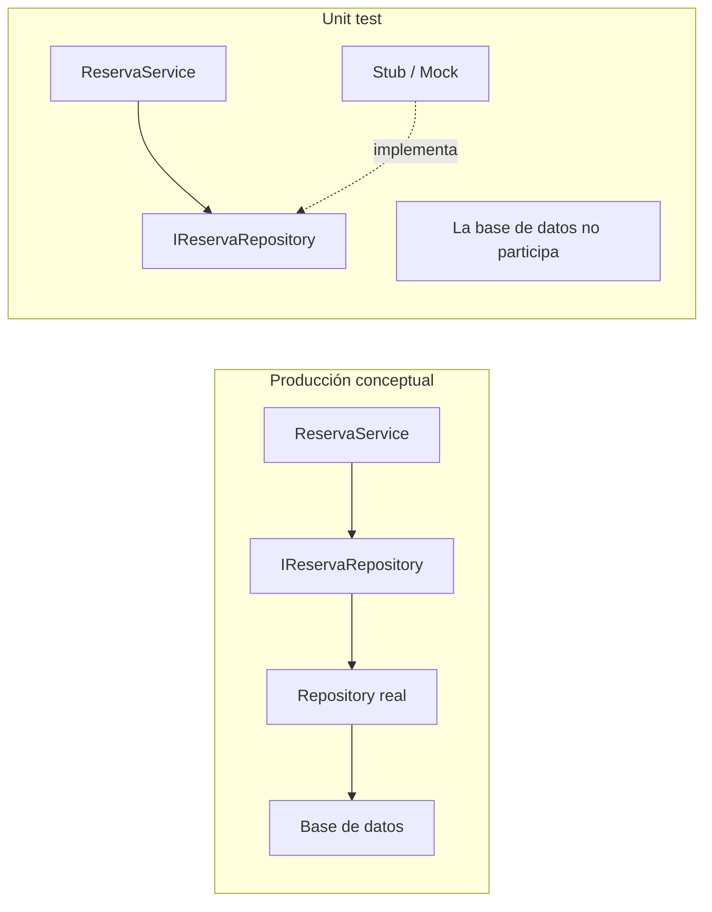

# 09b.1 — Mocks y Test Doubles

Lectura secundaria y opcional de [Lab09b](../README.md). El laboratorio puede comprenderse y ejecutarse sin este documento.

## El problema: una dependencia fuera de la unidad

En una aplicación con persistencia, el recorrido sería `ReservaService → IReservaRepository → repository real → base de datos`. Para un unit test queremos estudiar las decisiones del service con entradas conocidas, sin preparar la base ni depender de ella. Sustituimos su colaborador por un objeto controlado por el test.

Eso permite preguntar: si hay 2 cupos, ¿acepta una solicitud de 1? Si hay 0, ¿evita guardar? La calidad de la implementación persistente necesita pruebas de otro alcance.

## Test Double: nombre general

Un **Test Double** es un objeto usado en una prueba en lugar de una dependencia real. Dummy, Stub, Fake y Mock describen distintos papeles dentro de esa familia; no son necesariamente cuatro librerías distintas.

| Papel | Para qué sirve | Ejemplo conceptual |
| --- | --- | --- |
| **Dummy** | Completar un argumento que el test no utiliza. | Un colaborador requerido por un constructor, pero que ese escenario no consulta. |
| **Stub** | Proporcionar respuestas conocidas. | «Cuando te pregunten cuántos cupos hay, responde 2». |
| **Fake** | Implementar funcionalidad de forma simplificada. | Un repository que guarda objetos en una `List<T>` en memoria. |
| **Mock** | Comprobar las interacciones esperadas. | «GuardarReservaAsync debe llamarse exactamente una vez». |

En este lab sólo construimos dobles mediante Moq. No implementamos Dummies ni Fakes: sus ejemplos sirven para reconocer los términos. Un Fake tendría lógica propia que mantener; aquí no necesitamos construir ese comportamiento.

## Stub vs Mock en el código del laboratorio

El stub **controla respuestas**:

```csharp
repository.Setup(r => r.ObtenerCuposDisponiblesAsync(1)).ReturnsAsync(2);
```

Luego usamos `Assert.True(confirmado)` para verificar el resultado del service. La configuración pertenece a Arrange y establece las condiciones de la prueba.

El mock permite **comprobar interacciones**:

```csharp
repository.Verify(r => r.GuardarReservaAsync(1, 1), Times.Once());
```

La verificación pertenece a Assert y comprueba una llamada ya realizada. Para el caso sin disponibilidad, `Times.Never()` exige que no se haya solicitado guardar.

La clasificación es conceptual: el mismo objeto creado por `new Mock<IReservaRepository>()` puede configurar respuestas y registrar interacciones. El nombre `Mock<T>` de Moq no convierte todos sus usos en tests basados en interacciones. Configurar `Setup` tampoco verifica automáticamente que el método se haya invocado.

## El diseño permite sustituir la dependencia

**Los mocks no hacen que un diseño sea testeable por sí mismos.** En este ejemplo podemos controlar el colaborador porque el service recibe una abstracción, `IReservaRepository`, por constructor. Moq facilita crear una implementación controlada de ese contrato y entregarla como `repository.Object`.

Si el service construyera internamente un repository concreto conectado a SQLite, esta sustitución ya no estaría disponible mediante su constructor. DI permite elegir el colaborador desde afuera; no requiere usar el contenedor de ASP.NET Core ni existe únicamente para testing.



Fuente: [test-doubles.mmd](test-doubles.mmd). El lado de producción es conceptual: Lab09b no implementa repository real ni base de datos. En el unit test, el service consume la interfaz y el doble la implementa.

## Usar Verify cuando la pregunta lo justifica

`Assert` pregunta por resultados o estado; `Verify` pregunta por interacciones. Verificar que se solicitó guardar es relevante cuando el contrato de la operación incluye ese efecto. Verificar todas las llamadas, sus órdenes o detalles internos puede acoplar las pruebas a la implementación, dificultar el mantenimiento y volverlas frágiles ante refactorizaciones que conservan el comportamiento.

Los mocks son útiles para controlar colaboradores y comprobar efectos que no podemos observar directamente en la unidad. Elegimos qué verificar según el comportamiento esperado; no hace falta usar Verify en cada test ni reemplazar todos los objetos por mocks.

## Para profundizar

- [Microsoft — Buenas prácticas de unit testing en .NET](https://learn.microsoft.com/en-us/dotnet/core/testing/unit-testing-best-practices): aislamiento, claridad y diseño de las pruebas.
- [Moq — Repositorio oficial](https://github.com/devlooped/moq): proyecto, documentación y ejemplos de la herramienta utilizada.
- [Moq — Quickstart oficial](https://github.com/devlooped/moq/wiki/Quickstart): referencia práctica de Setup, retornos async y Verify; consultar según necesidad.
- [Martin Fowler — Mocks Aren't Stubs](https://martinfowler.com/articles/mocksArentStubs.html): lectura clásica sobre verificación de estado frente a verificación de interacciones y sus compromisos.
- [Martin Fowler — Test Double](https://martinfowler.com/bliki/TestDouble.html): síntesis del término general y sus variantes.
