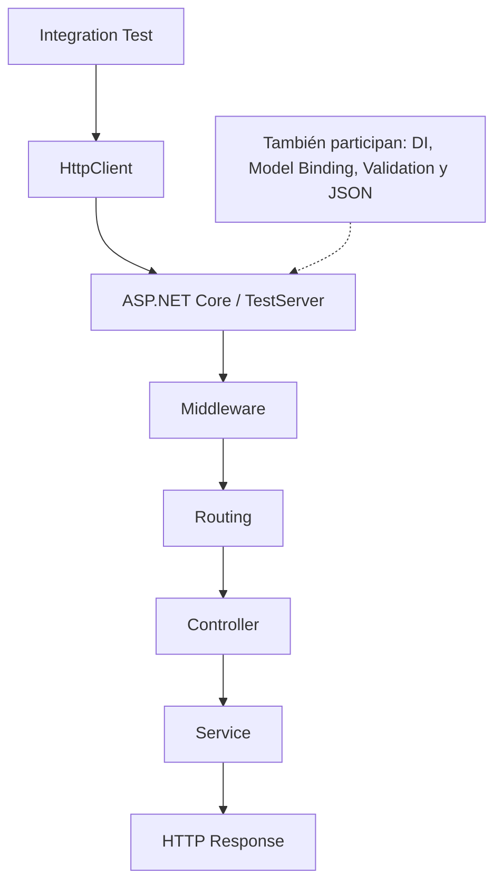

# Lab09c — Integration testing en ASP.NET Core

## Objetivo y evolución

Probar una API de reservas atravesando infraestructura real de ASP.NET Core en .NET 10. Lab09a probaba lógica aislada; Lab09b agregaba una dependencia sustituida por Moq. Aquí el test envía HTTP/JSON al Controller y al Service reales: no llama directamente a `service.ReservarAsync(...)`.

## Estructura

```text
Lab09c-IntegrationTesting/
├── Lab09c-IntegrationTesting.slnx
├── src/Lab09c.Reservas/
│   ├── Lab09c.Reservas.csproj
│   ├── Program.cs
│   ├── appsettings.json
│   ├── Contracts/CrearReservaRequest.cs
│   ├── Controllers/ReservasController.cs
│   ├── Models/Reserva.cs
│   └── Services/
│       ├── IReservaService.cs
│       └── ReservaService.cs
├── tests/Lab09c.Reservas.Tests/
│   ├── Lab09c.Reservas.Tests.csproj
│   └── ReservasIntegrationTests.cs
└── docs/
    ├── integration-testing.mmd
    └── 09c.1-Integration-Testing-en-ASP.NET-Core.md
```

El proyecto de tests referencia al proyecto web mediante `ProjectReference`. Agrega `Microsoft.AspNetCore.Mvc.Testing` **10.0.12**, xUnit v3 **3.2.2**, `xunit.runner.visualstudio` **3.1.5** y `Microsoft.NET.Test.Sdk` **18.10.1**. La aplicación usa el framework compartido ASP.NET Core, sin paquetes de persistencia ni mocking.

## Unit vs integration

| | Unit test, como Lab09b | Integration test de este lab |
| --- | --- | --- |
| Entrada | Llamada directa al Service | Request enviada por `HttpClient` |
| Colaborador | `Mock<IReservaRepository>` | Controller y Service reales registrados en DI |
| Foco | Reglas específicas, rápidas y aisladas | Que varias piezas procesen juntas una request |
| Infraestructura web | No comprueba routing, middleware, controllers, binding, JSON ni configuración DI | Participan esas piezas reales |

Son complementarios. Un unit test puede detectar una regla incorrecta; un integration test también detecta una ruta equivocada, una dependencia sin registrar o una respuesta JSON/HTTP incorrecta. No sustituimos Controller, Service o serialización por mocks: perderíamos la integración que queremos estudiar. Más adelante se pueden sustituir fronteras externas costosas o incontrolables manteniendo reales las piezas que se quieren integrar.

## Arquitectura del test



Diagrama: [integration-testing.mmd](docs/integration-testing.mmd). El middleware agrega `X-Lab09c: middleware`; el primer test comprueba esa cabecera para observar su ejecución.

## WebApplicationFactory y HttpClient

`WebApplicationFactory<Program>` arranca la aplicación del proyecto web, construye su host y prepara `TestServer`. `factory.CreateClient()` entrega un `HttpClient` conectado a ese servidor de pruebas en memoria. **No necesitamos `dotnet run`, un proceso externo ni un puerto real o fijo.** Las rutas del test son relativas; la dirección base del client no implica abrir un socket TCP.

Al final de `Program.cs`, `public partial class Program { }` hace público el tipo que C# genera para los top-level statements y permite referenciarlo desde el otro proyecto. El arranque sigue registrando los controllers y el service reales; el test no reemplaza sus implementaciones.

## Primer integration test

Leer primero `GetReserva_CuandoExiste_Devuelve200YJson`. Su mecanismo central es:

```csharp
// Arrange
using var factory = new WebApplicationFactory<Program>();
using var client = factory.CreateClient();
var cancellationToken = TestContext.Current.CancellationToken;

// Act
using var response = await client.GetAsync("/api/reservas/1", cancellationToken);

// Assert
Assert.Equal(HttpStatusCode.OK, response.StatusCode);
var reserva = await response.Content.ReadFromJsonAsync<Reserva>(cancellationToken);
Assert.NotNull(reserva);
Assert.Equal("Pendiente", reserva.Estado);
```

`ReadFromJsonAsync<T>()` convierte el body JSON recibido a un objeto. `PostAsJsonAsync(...)` serializa el DTO y envía una request con JSON. Los tests completos también comprueban `Content-Type`, datos significativos y, para la creación, `Location` y una consulta posterior. Ya no invocamos el método del service desde el test. Propagamos el token de xUnit a las operaciones HTTP/JSON para permitir que el runner cancele una prueba.

## Endpoints y cuatro tests

| Request | Resultado esperado | Qué comprueba el test |
| --- | --- | --- |
| `GET /api/reservas/1` | **200** + JSON | Reserva inicial Pendiente y cabecera del middleware. |
| `GET /api/reservas/2` en un host nuevo | **404** | No hay una reserva creada por otro test. |
| `POST /api/reservas` sin Estado válido | **400** + ValidationProblemDetails | Error de Estado y ausencia de una nueva reserva. |
| `POST /api/reservas` válido | **201** + JSON y Location | Datos creados y GET posterior con **200** usando Location. |

Los requests válidos contienen `ClienteId`, `Fecha` y `Estado`. La reserva inicial es Id 1; la primera creación de cada host recibe Id 2. No verificamos existencia de clientes ni reglas de calendario: el ejemplo mantiene pequeño el dominio.

## Validación, DI y almacenamiento

`CrearReservaRequest` usa `[Required]`, `[Range]` y `[StringLength]`. `int?` y `DateTime?` permiten representar un campo ausente/null, como en Lab07a. El test inválido deja Estado en `null`; `PostAsJsonAsync` lo envía como tal y la validación automática de `[ApiController]` genera **400 antes de ejecutar la Action**. No hay un `if (!ModelState.IsValid)` escrito en el Controller.

Model binding convierte JSON a DTO y validation evalúa sus atributos. El test deserializa `ValidationProblemDetails` y comprueba `errors["Estado"]`. El POST inválido no imprime `>>> Controller ejecutado: Crear reserva` ni crea una reserva. Para ver la salida detallada:

```powershell
dotnet test Lab09c-IntegrationTesting.slnx --logger "console;verbosity=detailed"
```

`IReservaService` se registra como **Singleton por aplicación** para conservar la colección entre el POST y el GET de un mismo host. La colección y el contador son de instancia, sin estado static; el diccionario concurrente y el contador atómico permiten accesos seguros a ese almacenamiento sencillo. Los métodos del service son síncronos porque sólo trabajan con objetos en memoria; los tests sí esperan operaciones HTTP mediante `await`.

No usamos base de datos ni EF InMemory provider. Así integramos el pipeline web y el service sin mezclar todavía la configuración y las garantías de persistencia. Se conserva el handler global estándar de Lab07b (`AddProblemDetails` / `UseExceptionHandler`) para respuestas de error sin detalles internos.

## Aislamiento y ejecución

Cada Fact crea y libera su propia factory y client con `using`. Al crear el client se arranca un host con su propio singleton, su reserva inicial y su contador. Dos requests dentro del mismo test comparten esa aplicación; **dos tests no comparten reservas**. No usamos `IClassFixture` con una factory compartida ni desactivamos el paralelismo para ocultar dependencias de orden.

Desde la raíz del repositorio:

```powershell
cd Lab09c-IntegrationTesting
dotnet restore Lab09c-IntegrationTesting.slnx
dotnet build Lab09c-IntegrationTesting.slnx
dotnet test Lab09c-IntegrationTesting.slnx
```

La solución agrupa los proyectos de `src` y `tests`, igual que Lab09a y Lab09b. Esperamos **4 tests correctos**. Para probar uno individualmente:

```powershell
dotnet test Lab09c-IntegrationTesting.slnx --filter "FullyQualifiedName~GetReserva_CuandoNoExiste"
```

## Experimentos

1. **Routing:** en [ReservasController.cs](src/Lab09c.Reservas/Controllers/ReservasController.cs), cambiar temporalmente `[Route("api/reservas")]` por `[Route("api/reservas-cambio")]`. Ejecutar `dotnet test Lab09c-IntegrationTesting.slnx`: las requests a la ruta anterior reciben 404 y fallan los tests que esperaban 200/400/201. El test del recurso inexistente puede seguir pasando: un 404 aislado no demuestra que encontró el endpoint. Restaurar la ruta.
2. **DI:** comentar temporalmente `builder.Services.AddSingleton<IReservaService, ReservaService>();` en [Program.cs](src/Lab09c.Reservas/Program.cs). Ejecutar la suite: el framework no puede construir el Controller porque falta su dependencia. El handler global devuelve 500 y los tests fallan por el status recibido. Restaurar el registro.
3. **Validación:** ejecutar sólo `dotnet test Lab09c-IntegrationTesting.slnx --filter "FullyQualifiedName~PostReserva_CuandoFaltaEstado"`. Se envía un DTO inválido, se verifica 400 con errores de validación y se comprueba que no creó una reserva. Relacionarlo con Lab07a; la Action de creación no se ejecuta.

Tras cualquier cambio temporal, restaurar y ejecutar la suite completa: el laboratorio debe quedar con todos los tests pasando.

## Lectura opcional y comparación con Spring

[Integration Testing en ASP.NET Core](docs/09c.1-Integration-Testing-en-ASP.NET-Core.md) amplía el alcance de estas pruebas, TestServer y la pirámide de testing. No es necesario leerlo para ejecutar el ejemplo.

`WebApplicationFactory` y `Microsoft.AspNetCore.Mvc.Testing` cumplen un papel comparable a la infraestructura de test de Spring Boot / `@SpringBootTest`: preparar una aplicación real para probarla. `HttpClient` es el cliente usado contra esa aplicación de test. TestServer transporta requests en memoria; no es una equivalencia exacta con levantar un servidor de Spring ni con MockMvc.

## Documentación oficial

- [Microsoft: integration tests en ASP.NET Core](https://learn.microsoft.com/en-us/aspnet/core/test/integration-tests?view=aspnetcore-10.0).
- [Microsoft: WebApplicationFactory](https://learn.microsoft.com/en-us/dotnet/api/microsoft.aspnetcore.mvc.testing.webapplicationfactory-1?view=aspnetcore-10.0).
- [Microsoft: paquete Microsoft.AspNetCore.Mvc.Testing](https://www.nuget.org/packages/Microsoft.AspNetCore.Mvc.Testing/10.0.12).

## Siguiente paso

Lab09a prueba lógica aislada; Lab09b prueba lógica aislada con dependencias sustituidas; Lab09c prueba la aplicación ASP.NET Core integrada. El siguiente gran tema será **Lab10-Authentication-Authorization**, pendiente. Después está previsto **Lab11-OpenAPI**; ninguno se implementa en esta iteración.
